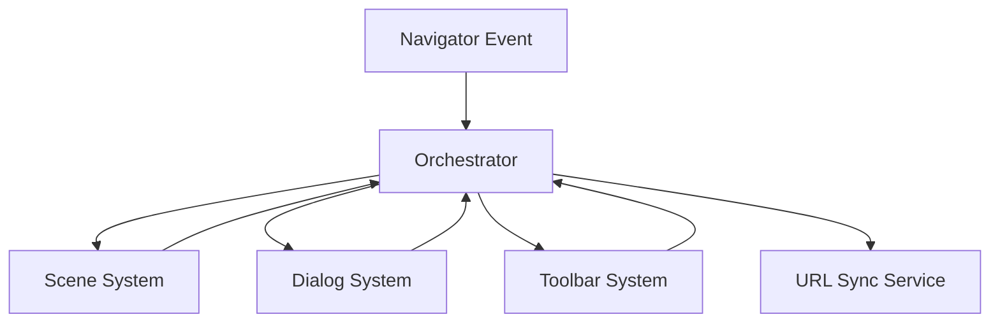

# Orchestrator System Architecture

## 🎯 **Overview**

The Orchestrator System manages system lifecycles, coordinates interactions between major subsystems, and optimizes performance across the Protogen platform. It serves as the central coordination layer that ensures smooth operation of scenes, navigation, dialogs, toolbars, and engagement features.

## 🏗️ **Core Responsibilities**

### **System Lifecycle Management**
- **Scene Loading**: Coordinate scene initialization and resource loading via SceneRouter
- **Dialog Management**: Coordinate dialog states and transitions
- **Toolbar Coordination**: Manage toolbar configurations and menu states
- **Resource Management**: Optimize loading and memory usage across systems
- **Performance Optimization**: Implement intelligent caching and lazy loading

### **System Coordination**
- **Event Orchestration**: Coordinate events between Navigator, Scene, Dialog, and Toolbar systems
- **State Synchronization**: Ensure consistent state across all systems
- **Shared Resources**: Manage shared resources and dependencies
- **Error Handling**: Centralized error handling and recovery
- **Cross-System Communication**: Facilitate inter-system messaging

### **Performance Management**
- **Caching Strategy**: Implement intelligent caching for scenes and components
- **Resource Optimization**: Optimize loading and memory usage
- **Lazy Loading**: Implement lazy loading for non-critical resources
- **Background Processing**: Handle background tasks and updates
- **Bundle Optimization**: Coordinate with SSR for optimal bundle delivery

## 🌐 **Shared Library Integration**

### **SSR Architecture**
The Orchestrator coordinates with the API for Server-Side Rendering of JavaScript bundles:

```typescript
interface OrchestratorSSRIntegration {
  // Bundle Management
  requestBundle(systemId: string): Promise<BundleManifest>;
  cacheBundle(systemId: string, bundle: Bundle): void;
  invalidateCache(systemId: string): void;
  
  // Hydration Coordination
  hydrateSystem(systemId: string, initialState: any): Promise<void>;
  dehydrateSystem(systemId: string): SerializedState;
  
  // Performance Optimization
  preloadCriticalBundles(): Promise<void>;
  lazyLoadSystem(systemId: string): Promise<void>;
}
```

### **System Module Loading**
Dynamic loading of system modules from shared library:

```typescript
interface SystemModuleLoader {
  // Module Resolution
  resolveModule(path: string): Promise<Module>;
  loadSystem(systemId: 'navigator' | 'dialog' | 'toolbar' | 'scene'): Promise<System>;
  
  // Dependency Management
  resolveDependencies(systemId: string): string[];
  loadDependencies(systemId: string): Promise<void>;
  
  // Cache Management
  getCachedModule(path: string): Module | null;
  invalidateModule(path: string): void;
}
```

## 🎬 **Scene-First Routing Coordination**

### **SceneRouter Integration**
The Orchestrator coordinates with SceneRouter for context-based scene resolution:

```typescript
interface SceneOrchestration {
  // Scene Resolution
  resolveScene(context: CurrentContext): string;
  loadScene(sceneId: string): Promise<SceneData>;
  unloadScene(sceneId: string): void;
  
  // Scene State Management
  cacheSceneState(sceneId: string, state: SceneState): void;
  getSceneState(sceneId: string): SceneState | null;
  
  // System Scene Handling
  loadSystemScene(sceneId: string): Promise<React.ComponentType>;
  isSystemScene(sceneId: string): boolean;
  
  // Performance Optimization
  preloadScene(sceneId: string): Promise<void>;
  optimizeSceneTransitions(): void;
}
```

### **Navigation Coordination**
Coordinates Navigator system events with scene loading:

```typescript
interface NavigationOrchestration {
  // Navigation Events
  onNavigationStart(target: NavigationTarget): void;
  onNavigationEnd(context: CurrentContext): void;
  onNavigationError(error: Error): void;
  
  // Context Synchronization
  syncContextToScene(context: CurrentContext): void;
  updateURLForContext(context: CurrentContext): void;
  
  // History Management
  trackNavigationEntry(entry: NavigationEntry): void;
  optimizeHistoryStorage(): void;
}
```

## 🎭 **Dialog System Coordination**

### **Dialog Lifecycle Management**
The Orchestrator manages dialog states and transitions:

```typescript
interface DialogOrchestration {
  // Dialog State Management
  openDialog(config: DialogConfig): string;
  closeDialog(dialogId: string): void;
  updateDialog(dialogId: string, updates: Partial<DialogConfig>): void;
  
  // Dialog Stack Management
  getDialogStack(): Dialog[];
  clearDialogStack(): void;
  prioritizeDialog(dialogId: string): void;
  
  // Dialog-Scene Interaction
  pauseSceneForDialog(dialogId: string): void;
  resumeSceneAfterDialog(dialogId: string): void;
  
  // Performance Optimization
  preloadDialogContent(dialogType: string): Promise<void>;
  optimizeDialogAnimations(): void;
}
```

### **Modal and Drawer Coordination**
Special handling for modal dialogs and drawer overlays:

```typescript
interface OverlayOrchestration {
  // Overlay Management
  showOverlay(config: OverlayConfig): void;
  hideOverlay(overlayId: string): void;
  
  // Z-Index Management
  allocateZIndex(componentType: 'toolbar' | 'drawer' | 'dialog'): number;
  releaseZIndex(zIndex: number): void;
  
  // Focus Management
  trapFocus(containerId: string): void;
  releaseFocus(containerId: string): void;
  restoreFocus(previousElement: HTMLElement): void;
}
```

## 🎛️ **Toolbar System Coordination**

### **Toolbar and Menu Management**
The Orchestrator coordinates toolbar configurations and menu states:

```typescript
interface ToolbarOrchestration {
  // Toolbar Configuration
  loadToolbarConfig(toolbarId: string): ToolbarConfig;
  updateToolbarConfig(toolbarId: string, config: Partial<ToolbarConfig>): void;
  
  // Menu State Management
  openMenu(menuId: string): void;
  closeMenu(menuId: string): void;
  toggleMenu(menuId: string): void;
  
  // Drawer Coordination
  openDrawer(drawerId: string): void;
  closeDrawer(drawerId: string): void;
  positionDrawer(drawerId: string, position: DrawerPosition): void;
  
  // Plugin Management
  registerToolbarPlugin(plugin: ToolbarPlugin): void;
  unregisterToolbarPlugin(pluginId: string): void;
  injectMenuItem(menuId: string, item: MenuItem): void;
}
```

### **Multi-Edge Toolbar Coordination**
Special handling for multiple toolbars on different edges:

```typescript
interface MultiEdgeOrchestration {
  // Edge Management
  getToolbarForEdge(edge: 'top' | 'bottom' | 'left' | 'right'): ToolbarConfig | null;
  allocateEdge(edge: string, toolbarId: string): void;
  releaseEdge(edge: string): void;
  
  // Responsive Behavior
  condenseToolbars(viewportSize: ViewportSize): void;
  expandToolbars(viewportSize: ViewportSize): void;
  optimizeForMobile(): void;
}
```

## 🔄 **Event Orchestration**

### **Cross-System Event Flow**
The Orchestrator manages events flowing between systems:



### **Event Coordination Patterns**

```typescript
interface EventOrchestration {
  // Event Registration
  registerEventBus(systemId: string, eventBus: EventEmitter): void;
  unregisterEventBus(systemId: string): void;
  
  // Event Routing
  routeEvent(event: SystemEvent, targetSystems: string[]): void;
  broadcastEvent(event: SystemEvent): void;
  
  // Event Filtering
  filterEventsByType(eventType: string): SystemEvent[];
  filterEventsBySystem(systemId: string): SystemEvent[];
  
  // Event History
  trackEvent(event: SystemEvent): void;
  getEventHistory(limit?: number): SystemEvent[];
  clearEventHistory(): void;
}
```

## 🎯 **Resource Management**

### **Memory Optimization**
The Orchestrator implements intelligent memory management:

```typescript
interface ResourceOrchestration {
  // Resource Tracking
  trackResource(resourceId: string, size: number): void;
  releaseResource(resourceId: string): void;
  getResourceUsage(): ResourceUsageReport;
  
  // Cache Management
  setCachePolicy(policy: CachePolicy): void;
  evictLRUResources(threshold: number): void;
  clearCache(scope?: 'all' | 'scenes' | 'dialogs'): void;
  
  // Preloading Strategy
  preloadCriticalResources(): Promise<void>;
  preloadForContext(context: CurrentContext): Promise<void>;
  cancelPreload(resourceId: string): void;
}
```

### **Bundle Management**
Coordinates with API for optimal bundle delivery:

```typescript
interface BundleOrchestration {
  // Bundle Loading
  loadBundle(bundleId: string): Promise<Bundle>;
  preloadBundle(bundleId: string): Promise<void>;
  
  // Bundle Caching
  cacheBundleLocally(bundleId: string, bundle: Bundle): void;
  getCachedBundle(bundleId: string): Bundle | null;
  
  // Bundle Versioning
  checkBundleVersion(bundleId: string): Promise<string>;
  updateBundle(bundleId: string): Promise<void>;
}
```

## 🔒 **Error Handling & Recovery**

### **Centralized Error Management**

```typescript
interface ErrorOrchestration {
  // Error Capture
  captureError(error: Error, context: ErrorContext): void;
  captureSystemError(systemId: string, error: Error): void;
  
  // Error Recovery
  attemptRecovery(error: Error): Promise<boolean>;
  fallbackToSafeState(systemId: string): void;
  
  // Error Reporting
  reportError(error: Error, severity: 'low' | 'medium' | 'high'): void;
  getErrorHistory(): ErrorReport[];
  
  // Error UI
  showErrorDialog(error: Error): void;
  showErrorToast(message: string): void;
}
```

## 📊 **Performance Monitoring**

### **System Performance Tracking**

```typescript
interface PerformanceOrchestration {
  // Metrics Collection
  trackNavigationTime(duration: number): void;
  trackSceneLoadTime(sceneId: string, duration: number): void;
  trackDialogRenderTime(dialogId: string, duration: number): void;
  
  // Performance Analysis
  getAverageNavigationTime(): number;
  getSlowScenes(): string[];
  getPerformanceReport(): PerformanceReport;
  
  // Optimization Triggers
  optimizeSlowSystems(): Promise<void>;
  recommendOptimizations(): Optimization[];
}
```

## 🧪 **Testing Coordination**

### **Integration Testing Support**

```typescript
interface TestOrchestration {
  // Test Setup
  setupTestEnvironment(): void;
  teardownTestEnvironment(): void;
  
  // Mock Systems
  mockSystem(systemId: string, mockImpl: any): void;
  restoreSystem(systemId: string): void;
  
  // State Inspection
  getSystemState(systemId: string): any;
  setSystemState(systemId: string, state: any): void;
  
  // Event Testing
  emitTestEvent(event: SystemEvent): void;
  getEmittedEvents(): SystemEvent[];
  clearEmittedEvents(): void;
}
```

## 🚀 **Future Enhancements**

### **Planned Improvements**
- [ ] Real-time collaboration coordination
- [ ] Advanced caching strategies (IndexedDB, Service Worker)
- [ ] Predictive preloading based on user behavior
- [ ] Performance budgets and enforcement
- [ ] Offline mode coordination
- [ ] Multi-tenant resource isolation
- [ ] GraphQL subscription coordination
- [ ] WebSocket event streaming

### **Mobile App Preparation**
The Orchestrator is designed to support future mobile app integration:
- Platform-agnostic system loading
- Native bridge communication
- Mobile-specific resource optimization
- Offline-first coordination
- Platform-specific performance tuning

## 📚 **Related Documentation**

- [SSR Architecture](./SSR_ARCHITECTURE.md) - Server-side rendering details
- [Navigator Systems Architecture](./NAVIGATOR_SYSTEMS_ARCHITECTURE.md) - Navigation system details
- [Dialog System Architecture](./DIALOG_SYSTEM_ARCHITECTURE.md) - Dialog system implementation
- [Scene-First Routing](./SCENE_FIRST_ROUTING.md) - Scene routing architecture
- [Shared Library Migration Guide](./SHARED_LIBRARY_MIGRATION_GUIDE.md) - Migration details

## 🎯 **Success Criteria**

The Orchestrator System is successful when:
- All systems coordinate smoothly without conflicts
- Performance remains optimal across all interactions
- Error recovery is automatic and transparent
- Resource usage is efficient and bounded
- Testing and debugging are simplified
- New systems integrate easily

**The Orchestrator provides the backbone for a cohesive, performant, and maintainable system architecture.** 🚀
