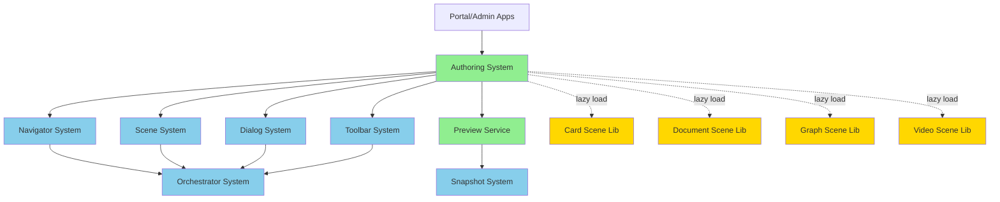

# Spec 01: Module Integration & Layout

**Initiative**: Authoring-Viewing Unification  
**Date**: October 14, 2025  
**Status**: Planning Phase  
**Type**: Foundation Specification  
**Depends On**: [Spec 00: Project Context](./00-project-context.md)

---

## Overview

This specification defines how authoring capabilities integrate into Protogen's existing module structure. All new code follows established patterns and extends existing systems rather than creating parallel architectures.

**Key Principle**: Extend existing `shared/src/systems/` structure, don't create new top-level modules.

---

## Existing Protogen Module Structure

### Current State

```
protogen/
├── admin/                    # Admin React app (Vite + TypeScript)
├── portal/                   # Portal React app (Vite + TypeScript)
├── shared/                   # Core UI library
│   └── src/
│       ├── systems/          # System modules (loadable)
│       │   ├── navigator/    # Navigation system
│       │   ├── dialog/       # Dialog system
│       │   ├── toolbar/      # Toolbar & menu system
│       │   ├── scene/        # Scene rendering
│       │   ├── slide/        # Slide system
│       │   └── flow/         # Flow system
│       ├── components/       # Shared UI components
│       ├── hooks/            # Shared React hooks
│       ├── services/         # Shared services
│       └── types/            # TypeScript types
├── api/                      # Laravel backend (PHP)
├── config/                   # Shared configuration
└── docs/                     # Documentation
```

### Export Pattern

```typescript
// Existing pattern for system modules
import { navigatorSystem } from '@protogen/shared/systems/navigator';
import { dialogSystem } from '@protogen/shared/systems/dialog';
import { toolbarSystem } from '@protogen/shared/systems/toolbar';
```

---

## Enhanced Module Structure

### New Additions

```
shared/
└── src/
    ├── systems/
    │   ├── authoring/           # ✨ NEW: Authoring system
    │   │   ├── index.ts         # Public API exports
    │   │   ├── AuthoringSystem.ts
    │   │   ├── AuthoringOverlay.tsx
    │   │   ├── SelectionEngine.ts
    │   │   ├── HighlightingEngine.ts
    │   │   ├── components/
    │   │   │   ├── SelectionHandles.tsx
    │   │   │   ├── InlineEditor.tsx
    │   │   │   └── PropertyInspector.tsx
    │   │   ├── hooks/
    │   │   │   ├── useAuthoring.ts
    │   │   │   ├── useSelection.ts
    │   │   │   └── useHighlighting.ts
    │   │   ├── types/
    │   │   │   ├── authoring.types.ts
    │   │   │   └── selection.types.ts
    │   │   └── __tests__/
    │   │       └── AuthoringSystem.test.ts
    │   │
    │   ├── navigator/           # ENHANCED: Authoring mode
    │   │   ├── ... (existing files)
    │   │   ├── AuthoringNavigator.ts    # ✨ NEW
    │   │   └── types/
    │   │       └── authoring.types.ts   # ✨ NEW
    │   │
    │   ├── scene/               # ENHANCED: New scene types
    │   │   ├── ... (existing files)
    │   │   ├── types/
    │   │   │   ├── card.types.ts        # ✨ NEW
    │   │   │   ├── document.types.ts    # ✨ NEW
    │   │   │   ├── graph.types.ts       # ✨ NEW (stub)
    │   │   │   └── video.types.ts       # ✨ NEW (stub)
    │   │   └── renderers/
    │   │       ├── CardRenderer.tsx     # ✨ NEW
    │   │       ├── DocumentRenderer.tsx # ✨ NEW
    │   │       ├── GraphRenderer.tsx    # ✨ NEW (stub)
    │   │       └── VideoRenderer.tsx    # ✨ NEW (stub)
    │   │
    │   └── orchestrator/        # ENHANCED: Dynamic loading
    │       ├── ... (existing files)
    │       ├── LibraryLoader.ts         # ✨ NEW
    │       └── AuthoringPolicy.ts       # ✨ NEW
    │
    ├── services/
    │   ├── ... (existing services)
    │   └── preview/             # ✨ NEW: Preview service
    │       ├── index.ts
    │       ├── PreviewService.ts
    │       ├── ThumbnailGenerator.ts
    │       ├── CacheManager.ts
    │       └── types/
    │           └── preview.types.ts
    │
    └── components/
        └── authoring/           # ✨ NEW: Authoring components
            ├── ContextMenu.tsx
            ├── PropertyPanel.tsx
            ├── ToC/
            │   ├── ToCTree.tsx
            │   ├── ToCItem.tsx
            │   └── ToCThumbnail.tsx
            └── PreviewCarousel/
                ├── Carousel.tsx
                ├── CarouselItem.tsx
                └── CarouselThumbnail.tsx
```

---

## System Module Specifications

### Authoring System Module

**Location**: `shared/src/systems/authoring/`

**Purpose**: Provide authoring capabilities as overlay on viewing

**Public API**:
```typescript
// shared/src/systems/authoring/index.ts
export { authoringSystem } from './AuthoringSystem';
export { AuthoringOverlay } from './AuthoringOverlay';
export { SelectionEngine } from './SelectionEngine';
export { HighlightingEngine } from './HighlightingEngine';

// Hooks
export { useAuthoring } from './hooks/useAuthoring';
export { useSelection } from './hooks/useSelection';
export { useHighlighting } from './hooks/useHighlighting';

// Types
export type {
  AuthoringMode,
  SelectionState,
  HighlightStyle,
  AuthoringConfig
} from './types/authoring.types';
```

**Core Class** (Interface):
```typescript
class AuthoringSystem {
  // Singleton pattern (like existing systems)
  private static instance: AuthoringSystem;
  static getInstance(): AuthoringSystem;
  
  // Mode management
  getMode(): 'view' | 'author';
  enterAuthorMode(): void;
  exitAuthorMode(): void;
  toggleMode(): void;
  
  // Selection management
  select(target: AuthoringTarget): void;
  getSelection(): SelectionState;
  clearSelection(): void;
  
  // Event emitters
  on(event: AuthoringEvent, handler: EventHandler): void;
  off(event: AuthoringEvent, handler: EventHandler): void;
  emit(event: AuthoringEvent, payload: any): void;
  
  // Integration
  attachToScene(sceneId: string): void;
  detachFromScene(): void;
}
```

**Events**:
- `mode-changed`: Authoring mode toggled
- `selection-changed`: Selection state updated
- `edit-started`: Editing operation began
- `edit-completed`: Editing operation finished
- `edit-canceled`: Editing operation canceled

### Preview Service

**Location**: `shared/src/services/preview/`

**Purpose**: Generate and manage scene/slide/page thumbnails

**Public API**:
```typescript
// shared/src/services/preview/index.ts
export { PreviewService } from './PreviewService';
export { ThumbnailGenerator } from './ThumbnailGenerator';
export { CacheManager } from './CacheManager';

export type {
  PreviewSize,
  PreviewMetadata,
  ThumbnailOptions,
  CachePolicy
} from './types/preview.types';
```

**Core Class** (Interface):
```typescript
class PreviewService {
  // Singleton pattern
  private static instance: PreviewService;
  static getInstance(): PreviewService;
  
  // Thumbnail generation
  generateThumbnail(
    target: PreviewTarget,
    size: PreviewSize
  ): Promise<string>;
  
  // Cache management
  getCached(key: string): PreviewMetadata | null;
  setCached(key: string, metadata: PreviewMetadata): void;
  invalidate(key: string): void;
  
  // Batch operations
  generateBatch(targets: PreviewTarget[]): Promise<Map<string, string>>;
  
  // Staleness detection
  isStale(key: string, hash: string): boolean;
}
```

**Preview Sizes**:
```typescript
type PreviewSize = 'xs' | 'sm' | 'md';

// Size specifications
const PREVIEW_DIMENSIONS = {
  xs: { width: 80, height: 60 },    // ToC thumbnails
  sm: { width: 160, height: 120 },  // Carousel items
  md: { width: 320, height: 240 }   // Overview boards
};
```

---

## Integration Points

### Navigator System Integration

**Enhancements** to `shared/src/systems/navigator/`:

```typescript
// NEW: Authoring-aware state
interface NavigatorState {
  // Existing fields
  mode: 'view' | 'author';  // ✨ NEW
  locus: {
    deckId?: string;
    sceneId?: string;
    itemId?: string;        // ✨ NEW: slide/page/node
  };
  // ... other existing fields
}

// NEW: Authoring navigation methods
class NavigatorSystem {
  // Existing methods...
  
  // ✨ NEW: Authoring mode
  enterAuthorMode(): void;
  exitAuthorMode(): void;
  getAuthoringMode(): 'view' | 'author';
  
  // ✨ NEW: Item navigation (slides/pages)
  navigateToItem(itemId: string): void;
  getCurrentItem(): string | null;
  
  // ✨ NEW: Zoom focus
  zoomToItem(itemId: string): Promise<void>;
  zoomOut(): Promise<void>;
}
```

### Toolbar System Integration

**Enhancements** to `shared/src/systems/toolbar/`:

```typescript
// NEW: ToC drawer config
interface ToolbarConfig {
  // Existing fields...
  
  // ✨ NEW: Drawer contents
  leftDrawer?: {
    type: 'toc';
    config: ToCConfig;
  };
  
  rightDrawer?: {
    type: 'properties';
    config: PropertiesConfig;
  };
}

// NEW: Preview Carousel widget
interface PreviewCarouselWidget extends ToolbarWidget {
  type: 'preview-carousel';
  position: 'top';  // Phase 1
  config: {
    size: 'sm' | 'md';
    maxItems: number;
    showLabels: boolean;
  };
}
```

### Scene System Integration

**Enhancements** to `shared/src/systems/scene/`:

```typescript
// NEW: Scene type registry
type SceneType = 'card' | 'document' | 'graph' | 'video';

interface SceneTypeConfig {
  type: SceneType;
  renderer: React.ComponentType<SceneProps>;
  authoringRenderer?: React.ComponentType<AuthoringSceneProps>;
  previewGenerator: (scene: Scene) => Promise<string>;
}

// NEW: Scene registry
class SceneRegistry {
  registerType(config: SceneTypeConfig): void;
  getRenderer(type: SceneType, mode: 'view' | 'author'): React.ComponentType;
  getPreviewGenerator(type: SceneType): (scene: Scene) => Promise<string>;
}
```

### Orchestrator System Integration

**Enhancements** to `shared/src/systems/orchestrator/`:

```typescript
// NEW: Library loading
class OrchestratorSystem {
  // Existing methods...
  
  // ✨ NEW: Dynamic library loading
  async loadAuthoringLibrary(sceneType: SceneType): Promise<void>;
  async unloadAuthoringLibrary(sceneType: SceneType): Promise<void>;
  
  // ✨ NEW: Policy enforcement
  canLoadAuthoring(): boolean;
  enforceAuthoringPolicy(): void;
}

// NEW: Authoring policy
interface AuthoringPolicy {
  loadLibrariesOnlyInAuthorMode: boolean;
  preloadSceneTypes?: SceneType[];
  lazyLoadThreshold: number;
}
```

---

## Dependency Graph



**Legend**:
- Blue: Existing Protogen systems
- Green: New systems (integrated)
- Gold: Lazy-loaded libraries

---

## Package.json Exports

### Shared Library Exports

**Update** `shared/package.json`:

```json
{
  "name": "@protogen/shared",
  "exports": {
    ".": "./dist/src/index.js",
    
    // Existing exports
    "./systems/navigator": "./dist/src/systems/navigator/index.js",
    "./systems/dialog": "./dist/src/systems/dialog/index.js",
    "./systems/toolbar": "./dist/src/systems/toolbar/index.js",
    "./systems/scene": "./dist/src/systems/scene/index.js",
    "./systems/flow": "./dist/src/systems/flow/index.js",
    
    // ✨ NEW: Authoring system
    "./systems/authoring": "./dist/src/systems/authoring/index.js",
    
    // ✨ NEW: Orchestrator system (if not already exported)
    "./systems/orchestrator": "./dist/src/systems/orchestrator/index.js",
    
    // ✨ NEW: Preview service
    "./services/preview": "./dist/src/services/preview/index.js",
    
    // ✨ NEW: Authoring components
    "./components/authoring": "./dist/src/components/authoring/index.js",
    
    // Existing exports
    "./components": "./dist/src/components/index.js",
    "./hooks": "./dist/src/hooks/index.js",
    "./types": "./dist/src/types/index.js"
  }
}
```

---

## Import Examples

### Using Authoring System

```typescript
// Portal or Admin app
import { authoringSystem, useAuthoring } from '@protogen/shared/systems/authoring';
import { SelectionEngine } from '@protogen/shared/systems/authoring';

function SceneEditor() {
  const { mode, enterAuthorMode, exitAuthorMode } = useAuthoring();
  
  const handleToggle = () => {
    if (mode === 'view') {
      authoringSystem.enterAuthorMode();
    } else {
      authoringSystem.exitAuthorMode();
    }
  };
  
  return (
    <button onClick={handleToggle}>
      {mode === 'view' ? 'Edit' : 'Done'}
    </button>
  );
}
```

### Using Preview Service

```typescript
import { PreviewService } from '@protogen/shared/services/preview';

async function generateScenePreviews(scene: Scene) {
  const previewService = PreviewService.getInstance();
  
  // Generate thumbnails for all sizes
  const [xs, sm, md] = await Promise.all([
    previewService.generateThumbnail({ sceneId: scene.id }, 'xs'),
    previewService.generateThumbnail({ sceneId: scene.id }, 'sm'),
    previewService.generateThumbnail({ sceneId: scene.id }, 'md')
  ]);
  
  return { xs, sm, md };
}
```

### Using Scene Type Renderers

```typescript
import { SceneRenderer } from '@protogen/shared/systems/scene';

function Scene({ sceneId, mode }: SceneProps) {
  const scene = useScene(sceneId);
  
  // Scene system automatically picks the right renderer
  // based on scene type and authoring mode
  return <SceneRenderer scene={scene} mode={mode} />;
}
```

---

## Migration Strategy

### Phase 1: Setup (Week 1)

1. **Create Directory Structure**
   ```bash
   mkdir -p shared/src/systems/authoring/{components,hooks,types,__tests__}
   mkdir -p shared/src/services/preview/types
   mkdir -p shared/src/components/authoring/{ToC,PreviewCarousel}
   ```

2. **Add Package Exports**
   - Update `shared/package.json` with new exports
   - Update TypeScript paths in `tsconfig.json`

3. **Create Stub Files**
   - Empty classes with interfaces
   - Type definitions
   - Export statements

### Phase 2: Navigator Enhancement (Week 1-2)

1. **Add Authoring Mode to State**
   - Extend NavigatorState interface
   - Add mode toggle methods
   - Update URL sync for mode

2. **Add Item Navigation**
   - navigateToItem method
   - Zoom focus capabilities
   - History management

### Phase 3: Scene Type Infrastructure (Week 2-3)

1. **Create Scene Registry**
   - Scene type registration
   - Renderer lookup
   - Preview generator registry

2. **Add Type Stubs**
   - Card, Document, Graph, Video types
   - Basic interfaces only
   - No implementations yet

### Phase 4: Preview Service (Week 3-4)

1. **Implement PreviewService**
   - Thumbnail generation
   - Cache management
   - Batch operations

2. **Integrate with Snapshot System**
   - Extend existing snapshot patterns
   - Reuse rendering pipeline
   - Add size tier support

### Phase 5: Authoring System Core (Week 4-5)

1. **Implement AuthoringSystem**
   - Mode management
   - Selection engine
   - Event system

2. **Create React Components**
   - AuthoringOverlay
   - SelectionHandles
   - Basic UI primitives

---

## Testing Strategy

### Unit Tests

**Authoring System**:
```typescript
// shared/src/systems/authoring/__tests__/AuthoringSystem.test.ts
describe('AuthoringSystem', () => {
  it('should toggle between view and author modes', () => {
    // Test mode toggle
  });
  
  it('should manage selection state', () => {
    // Test selection
  });
  
  it('should emit mode-changed events', () => {
    // Test events
  });
});
```

**Preview Service**:
```typescript
// shared/src/services/preview/__tests__/PreviewService.test.ts
describe('PreviewService', () => {
  it('should generate thumbnails at different sizes', async () => {
    // Test thumbnail generation
  });
  
  it('should cache generated previews', () => {
    // Test caching
  });
  
  it('should detect stale previews', () => {
    // Test staleness
  });
});
```

### Integration Tests

**Navigator + Authoring**:
```typescript
describe('Navigator Authoring Integration', () => {
  it('should enter author mode and update state', () => {
    // Test integration
  });
  
  it('should navigate to items in author mode', () => {
    // Test navigation
  });
});
```

---

## Performance Considerations

### Lazy Loading

**Authoring Libraries**:
- Load only when entering author mode
- Use dynamic imports
- Unload when exiting author mode

```typescript
// Lazy loading pattern
async function loadAuthoringLibrary(sceneType: SceneType) {
  switch (sceneType) {
    case 'card':
      return await import('./scene-types/card/authoring');
    case 'document':
      return await import('./scene-types/document/authoring');
    // ...
  }
}
```

### Code Splitting

**Bundle Strategy**:
- Core viewing: Always loaded
- Authoring system: Lazy loaded
- Scene type libs: Lazy loaded per type
- Preview service: Lazy loaded with authoring

**Expected Bundle Sizes**:
- Core viewing: ~200KB
- Authoring system: ~50KB
- Card scene lib: ~30KB
- Document scene lib: ~40KB
- Preview service: ~20KB

---

## Folder Structure Summary

```
shared/src/
├── systems/
│   ├── authoring/           # ✨ NEW: ~2KB types, implementations TBD
│   ├── navigator/           # ENHANCED: +authoring mode
│   ├── scene/               # ENHANCED: +scene types
│   ├── orchestrator/        # ENHANCED: +library loading
│   ├── dialog/              # UNCHANGED
│   ├── toolbar/             # ENHANCED: +drawer configs
│   ├── flow/                # UNCHANGED
│   └── slide/               # UNCHANGED
│
├── services/
│   ├── preview/             # ✨ NEW: ~1KB types, implementations TBD
│   └── ... (existing)
│
├── components/
│   ├── authoring/           # ✨ NEW: ~1KB types, implementations TBD
│   └── ... (existing)
│
├── hooks/                   # ENHANCED: +authoring hooks
├── types/                   # ENHANCED: +authoring types
└── ... (existing)
```

**Total New Code** (Planning Phase):
- Type definitions only: ~5KB
- Interfaces and contracts: ~10KB
- No implementations yet

---

## Acceptance Criteria

- [x] Module structure extends existing `shared/src/systems/`
- [x] New systems follow singleton pattern (like existing)
- [x] Export pattern consistent with existing systems
- [x] Integration points clearly defined
- [x] Dependency graph documented
- [x] Migration strategy outlined
- [x] Testing strategy defined
- [x] Performance considerations documented
- [x] No breaking changes to existing structure
- [x] Folder structure summary provided

**Status**: ✅ Complete - Ready for Spec 02

---

## Next Steps

**Spec 02**: Event Taxonomy & Contracts
- Define new event types
- Extend existing event system
- Payload schemas
- Sequence diagrams

---

## References

- **Previous**: [Spec 00: Project Context](./00-project-context.md)
- **Next**: [Spec 02: Event Taxonomy](./02-event-taxonomy.md)
- **Master Plan**: `docs/active-development/AUTHORING_VIEWING_UNIFICATION.md`
- **Protogen Structure**: `docs/DEVELOPMENT.md`

---

## Changelog

**2025-10-14**: Initial specification created  
**Status**: Ready for stakeholder review

