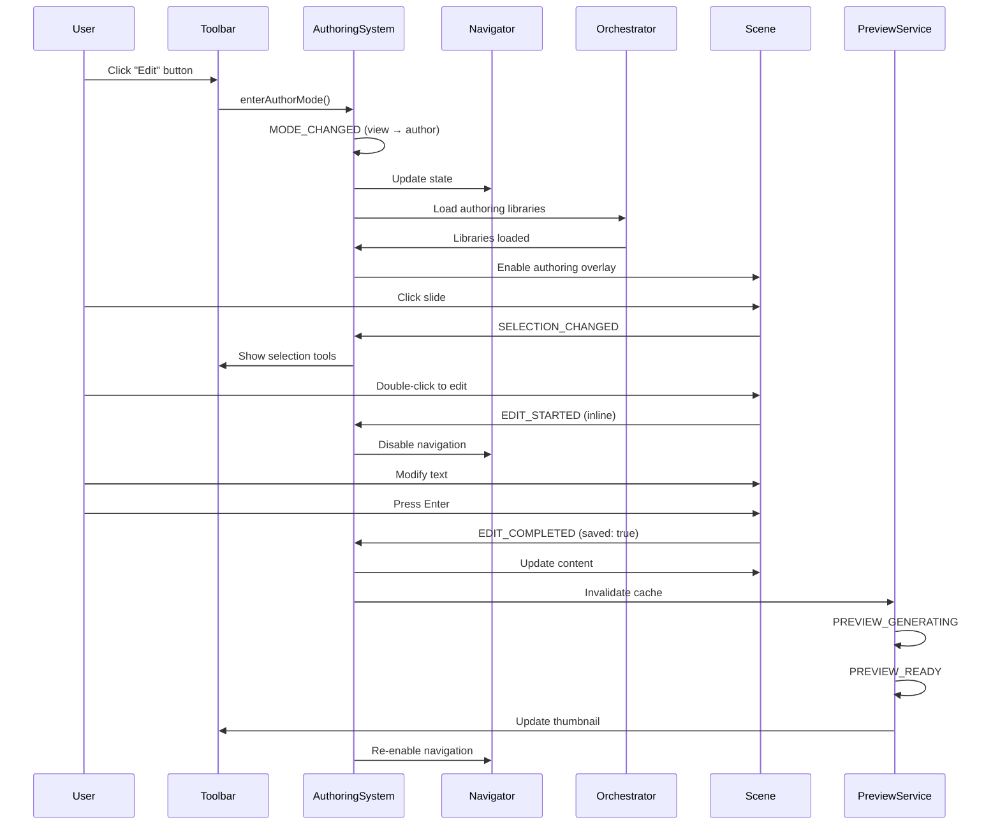
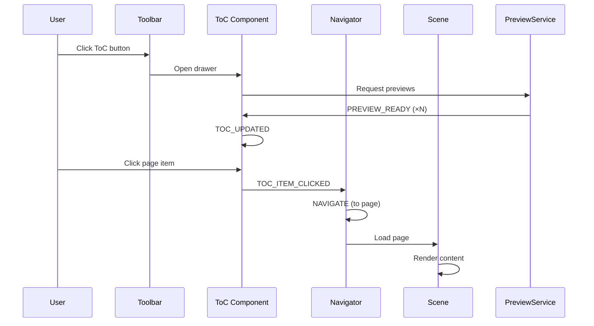
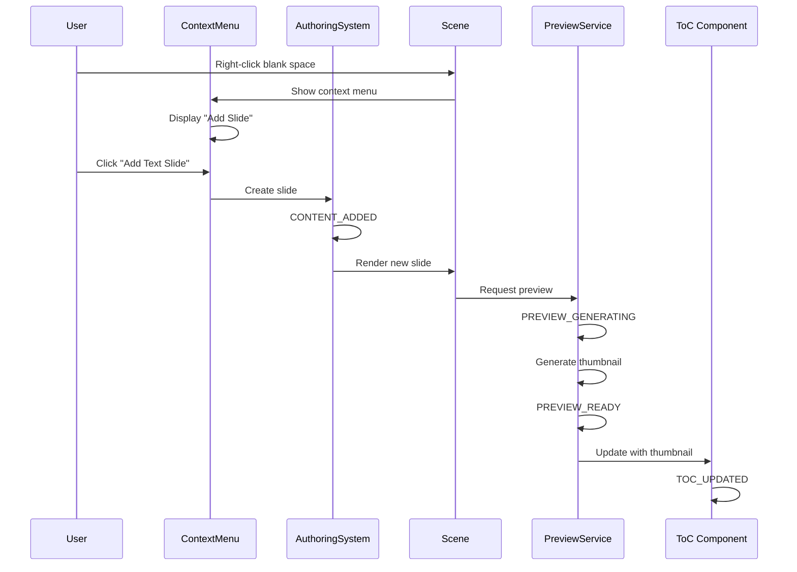

# Spec 02: Event Taxonomy & Contracts

**Initiative**: Authoring-Viewing Unification  
**Date**: October 14, 2025  
**Status**: Planning Phase  
**Type**: Core Contract Specification  
**Depends On**: [Spec 00](./00-project-context.md), [Spec 01](./01-module-integration.md)

---

## Overview

This specification defines the event taxonomy for authoring interactions, extending Protogen's existing event system. Events enable loose coupling between subsystems while maintaining clear contracts for communication.

**Principle**: Events are the primary communication mechanism between subsystems.

---

## Existing Event System

### Protogen's Current Event Architecture

**Pattern**: Custom EventEmitter in each system

```typescript
// Existing pattern from Navigator, Dialog, Toolbar systems
class SystemEventEmitter {
  private listeners: Map<string, Set<EventHandler>>;
  
  on(event: string, handler: EventHandler): void;
  off(event: string, handler: EventHandler): void;
  emit(event: string, payload: any): void;
}
```

**Existing Events** (preserve all):
- Navigator: `navigate`, `context-changed`, `url-changed`
- Dialog: `dialog-opened`, `dialog-closed`, `dialog-confirmed`
- Toolbar: `menu-action`, `drawer-opened`, `drawer-closed`
- Scene: `scene-loaded`, `scene-rendered`

---

## New Event Categories

### 1. Authoring Mode Events

**Purpose**: Communicate authoring mode state changes

#### `MODE_CHANGED`

**Emitter**: AuthoringSystem  
**When**: User toggles between view and author modes

**Payload**:
```typescript
interface ModeChangedPayload {
  previousMode: 'view' | 'author';
  currentMode: 'view' | 'author';
  timestamp: number;
  triggeredBy: 'user' | 'system';
}
```

**Example**:
```typescript
authoringSystem.emit('MODE_CHANGED', {
  previousMode: 'view',
  currentMode: 'author',
  timestamp: Date.now(),
  triggeredBy: 'user'
});
```

**Subscribers**:
- Navigator (update navigation state)
- Toolbar (show/hide authoring controls)
- Orchestrator (load/unload authoring libraries)
- Scene (enable/disable authoring overlay)

---

### 2. Selection Events

**Purpose**: Communicate selection state changes

#### `SELECTION_CHANGED`

**Emitter**: SelectionEngine  
**When**: User selects/deselects scene elements

**Payload**:
```typescript
interface SelectionChangedPayload {
  sceneId: string;
  sceneType: SceneType;
  previousSelection: SelectionState | null;
  currentSelection: SelectionState | null;
  action: 'select' | 'deselect' | 'multi-select' | 'clear';
}

interface SelectionState {
  targetType: 'slide' | 'page' | 'node' | 'edge' | 'text' | 'image' | 'block';
  targetId: string;
  bounds?: DOMRect;
  metadata?: Record<string, any>;
}
```

**Example**:
```typescript
selectionEngine.emit('SELECTION_CHANGED', {
  sceneId: 'scene-123',
  sceneType: 'card',
  previousSelection: null,
  currentSelection: {
    targetType: 'slide',
    targetId: 'slide-456',
    bounds: { x: 0, y: 0, width: 800, height: 600 },
    metadata: { kind: 'text', order: 1 }
  },
  action: 'select'
});
```

**Subscribers**:
- AuthoringOverlay (show selection UI)
- PropertyInspector (load selected item properties)
- Toolbar (update contextual actions)
- Navigator (track selection in state)

#### `MULTI_SELECT_CHANGED`

**Emitter**: SelectionEngine  
**When**: Multiple items selected (Ctrl+Click, Shift+Click)

**Payload**:
```typescript
interface MultiSelectChangedPayload {
  sceneId: string;
  selections: SelectionState[];
  action: 'add' | 'remove' | 'replace';
}
```

---

### 3. Editing Events

**Purpose**: Communicate editing operations

#### `EDIT_STARTED`

**Emitter**: AuthoringSystem  
**When**: User begins editing an element

**Payload**:
```typescript
interface EditStartedPayload {
  sceneId: string;
  editType: 'inline' | 'modal' | 'drawer';
  targetType: string;
  targetId: string;
  initialValue: any;
}
```

**Example**:
```typescript
authoringSystem.emit('EDIT_STARTED', {
  sceneId: 'scene-123',
  editType: 'inline',
  targetType: 'text',
  targetId: 'slide-456',
  initialValue: { text: 'Original text', fontSize: 16 }
});
```

**Subscribers**:
- Navigator (disable navigation during edit)
- Toolbar (show edit-specific controls)
- Dialog (open property inspector if modal)

#### `EDIT_COMPLETED`

**Emitter**: AuthoringSystem  
**When**: User completes editing

**Payload**:
```typescript
interface EditCompletedPayload {
  sceneId: string;
  targetId: string;
  previousValue: any;
  newValue: any;
  saved: boolean;
}
```

**Example**:
```typescript
authoringSystem.emit('EDIT_COMPLETED', {
  sceneId: 'scene-123',
  targetId: 'slide-456',
  previousValue: { text: 'Original text' },
  newValue: { text: 'Updated text' },
  saved: true
});
```

**Subscribers**:
- Scene (update rendered content)
- Preview Service (invalidate cache, regenerate preview)
- Navigator (re-enable navigation)
- Persistence (save changes if applicable)

#### `EDIT_CANCELED`

**Emitter**: AuthoringSystem  
**When**: User cancels editing (Escape key, Cancel button)

**Payload**:
```typescript
interface EditCanceledPayload {
  sceneId: string;
  targetId: string;
  editType: string;
}
```

---

### 4. Content Modification Events

**Purpose**: Communicate structural changes to scenes

#### `CONTENT_ADDED`

**Emitter**: AuthoringSystem  
**When**: New content added (slide, page, node, etc.)

**Payload**:
```typescript
interface ContentAddedPayload {
  sceneId: string;
  contentType: 'slide' | 'page' | 'node' | 'edge' | 'block';
  contentId: string;
  parentId?: string;
  position?: number;
  data: any;
}
```

**Example**:
```typescript
authoringSystem.emit('CONTENT_ADDED', {
  sceneId: 'scene-123',
  contentType: 'slide',
  contentId: 'slide-789',
  position: 2,
  data: { kind: 'text', text: 'New slide' }
});
```

**Subscribers**:
- Scene (render new content)
- ToC (update tree structure)
- Navigator (update item count)
- Preview Service (generate preview for new content)

#### `CONTENT_REMOVED`

**Emitter**: AuthoringSystem  
**When**: Content deleted

**Payload**:
```typescript
interface ContentRemovedPayload {
  sceneId: string;
  contentType: string;
  contentId: string;
  previousData?: any;
}
```

**Subscribers**:
- Scene (remove from render)
- ToC (update tree structure)
- Preview Service (remove cached preview)
- Persistence (mark for deletion)

#### `CONTENT_REORDERED`

**Emitter**: AuthoringSystem  
**When**: Content order changed (drag-drop reordering)

**Payload**:
```typescript
interface ContentReorderedPayload {
  sceneId: string;
  contentType: string;
  previousOrder: string[];  // Array of IDs
  newOrder: string[];
}
```

---

### 5. Preview Events

**Purpose**: Communicate preview generation status

#### `PREVIEW_GENERATING`

**Emitter**: PreviewService  
**When**: Preview generation started

**Payload**:
```typescript
interface PreviewGeneratingPayload {
  targetType: 'scene' | 'slide' | 'page';
  targetId: string;
  size: PreviewSize;
  estimatedTime?: number;
}
```

#### `PREVIEW_READY`

**Emitter**: PreviewService  
**When**: Preview successfully generated

**Payload**:
```typescript
interface PreviewReadyPayload {
  targetType: 'scene' | 'slide' | 'page';
  targetId: string;
  size: PreviewSize;
  dataUrl: string;
  hash: string;
  metadata: PreviewMetadata;
}
```

**Example**:
```typescript
previewService.emit('PREVIEW_READY', {
  targetType: 'scene',
  targetId: 'scene-123',
  size: 'sm',
  dataUrl: 'data:image/png;base64,...',
  hash: 'abc123',
  metadata: {
    width: 160,
    height: 120,
    generatedAt: Date.now()
  }
});
```

**Subscribers**:
- ToC (display thumbnail)
- Preview Carousel (update thumbnail)
- Cache (store generated preview)

#### `PREVIEW_FAILED`

**Emitter**: PreviewService  
**When**: Preview generation failed

**Payload**:
```typescript
interface PreviewFailedPayload {
  targetId: string;
  size: PreviewSize;
  error: Error;
  retryable: boolean;
}
```

---

### 6. ToC Events

**Purpose**: Communicate ToC interactions

#### `TOC_UPDATED`

**Emitter**: ToC Component  
**When**: ToC structure changes

**Payload**:
```typescript
interface ToCUpdatedPayload {
  deckId?: string;
  sceneId?: string;
  treeStructure: ToCNode[];
  expandedNodes: Set<string>;
}

interface ToCNode {
  id: string;
  type: 'deck' | 'scene' | 'slide' | 'page';
  label: string;
  children?: ToCNode[];
  preview?: string;  // Data URL for thumbnail
}
```

**Subscribers**:
- Navigator (sync selection state)
- Toolbar (update drawer state)

#### `TOC_ITEM_CLICKED`

**Emitter**: ToC Component  
**When**: User clicks ToC item

**Payload**:
```typescript
interface ToCItemClickedPayload {
  itemId: string;
  itemType: 'deck' | 'scene' | 'slide' | 'page';
  modifiers: {
    ctrl: boolean;
    shift: boolean;
    alt: boolean;
  };
}
```

**Subscribers**:
- Navigator (navigate to item)
- Scene (render selected item)

---

### 7. Navigator Integration Events

**Purpose**: Extend existing Navigator events for authoring

#### `NAVIGATE` (Extended)

**Existing Payload** + **New Fields**:
```typescript
interface NavigatePayload {
  // Existing fields
  path: string;
  sceneId?: string;
  deckId?: string;
  
  // ✨ NEW: Authoring-specific fields
  itemId?: string;  // slide/page/node ID
  itemType?: 'slide' | 'page' | 'node';
  authoringMode?: boolean;
  zoomLevel?: number;
}
```

#### `FOCUS` (New)

**Emitter**: Navigator  
**When**: User focuses on specific item (zoom-in)

**Payload**:
```typescript
interface FocusPayload {
  sceneId: string;
  itemId?: string;
  itemType?: 'slide' | 'page' | 'node';
  previousFocus?: { itemId: string; itemType: string };
  zoomLevel: number;
  animated: boolean;
}
```

#### `ZOOM` (New)

**Emitter**: Navigator  
**When**: Zoom level changes

**Payload**:
```typescript
interface ZoomPayload {
  sceneId: string;
  previousZoom: number;
  currentZoom: number;
  target?: { itemId: string; itemType: string };
}
```

---

## Event Flow Sequences

### Sequence 1: Enter Author Mode → Edit Slide → Save



### Sequence 2: Open ToC → Navigate to Page



### Sequence 3: Add New Slide → Generate Preview



---

## Error Handling

### Event Error Contract

All events may fail. Errors are communicated via error events:

```typescript
interface EventError {
  originalEvent: string;
  payload: any;
  error: Error;
  retryable: boolean;
  timestamp: number;
}

// Error event pattern
system.emit('ERROR', {
  originalEvent: 'EDIT_COMPLETED',
  payload: originalPayload,
  error: new Error('Failed to save'),
  retryable: true,
  timestamp: Date.now()
});
```

### Handling Strategies

**Retry Logic**:
```typescript
async function emitWithRetry(event: string, payload: any, maxRetries = 3) {
  for (let i = 0; i < maxRetries; i++) {
    try {
      await system.emit(event, payload);
      return;
    } catch (error) {
      if (i === maxRetries - 1) {
        system.emit('ERROR', {
          originalEvent: event,
          payload,
          error,
          retryable: false,
          timestamp: Date.now()
        });
      }
    }
  }
}
```

**Fallback UI**:
- Show toast notification on error
- Provide retry action
- Log to console in development

---

## Idempotency

### Idempotent Events

Some events must be idempotent (can be processed multiple times safely):

**Idempotent**:
- `SELECTION_CHANGED` (last one wins)
- `MODE_CHANGED` (state-based)
- `PREVIEW_READY` (cache keyed by ID+hash)

**Not Idempotent** (require deduplication):
- `CONTENT_ADDED` (creates new items)
- `CONTENT_REMOVED` (destructive)
- `EDIT_COMPLETED` (may trigger side effects)

### Deduplication Strategy

```typescript
class EventDeduplicator {
  private recentEvents = new Map<string, number>();
  private dedupWindow = 100; // ms
  
  shouldProcess(event: string, payloadHash: string): boolean {
    const key = `${event}:${payloadHash}`;
    const lastTime = this.recentEvents.get(key);
    const now = Date.now();
    
    if (lastTime && now - lastTime < this.dedupWindow) {
      return false; // Duplicate
    }
    
    this.recentEvents.set(key, now);
    return true; // Process
  }
}
```

---

## Event Priority

Some events need priority processing:

```typescript
enum EventPriority {
  CRITICAL = 0,  // MODE_CHANGED, ERROR
  HIGH = 1,      // EDIT_COMPLETED, CONTENT_ADDED
  NORMAL = 2,    // SELECTION_CHANGED, NAVIGATE
  LOW = 3        // PREVIEW_READY, TOC_UPDATED
}

class PriorityEventEmitter {
  private queues: Map<EventPriority, EventQueue>;
  
  emit(event: string, payload: any, priority: EventPriority = EventPriority.NORMAL) {
    this.queues.get(priority).enqueue({ event, payload });
    this.processQueues();
  }
  
  private processQueues() {
    // Process CRITICAL first, then HIGH, etc.
    for (const priority of [0, 1, 2, 3]) {
      while (!this.queues.get(priority).isEmpty()) {
        const { event, payload } = this.queues.get(priority).dequeue();
        this.processEvent(event, payload);
      }
    }
  }
}
```

---

## Complete Event Registry

### Summary Table

| Event | Emitter | Priority | Idempotent | Subscribers |
|-------|---------|----------|------------|-------------|
| `MODE_CHANGED` | AuthoringSystem | CRITICAL | Yes | Navigator, Toolbar, Orchestrator, Scene |
| `SELECTION_CHANGED` | SelectionEngine | NORMAL | Yes | Overlay, Inspector, Toolbar, Navigator |
| `MULTI_SELECT_CHANGED` | SelectionEngine | NORMAL | Yes | Overlay, Inspector, Toolbar |
| `EDIT_STARTED` | AuthoringSystem | HIGH | No | Navigator, Toolbar, Dialog |
| `EDIT_COMPLETED` | AuthoringSystem | HIGH | No | Scene, Preview, Navigator, Persistence |
| `EDIT_CANCELED` | AuthoringSystem | NORMAL | Yes | Navigator, Toolbar |
| `CONTENT_ADDED` | AuthoringSystem | HIGH | No | Scene, ToC, Navigator, Preview |
| `CONTENT_REMOVED` | AuthoringSystem | HIGH | No | Scene, ToC, Preview, Persistence |
| `CONTENT_REORDERED` | AuthoringSystem | NORMAL | No | Scene, ToC, Persistence |
| `PREVIEW_GENERATING` | PreviewService | LOW | Yes | ToC, Carousel |
| `PREVIEW_READY` | PreviewService | LOW | Yes | ToC, Carousel, Cache |
| `PREVIEW_FAILED` | PreviewService | NORMAL | No | UI (Toast), Logger |
| `TOC_UPDATED` | ToC Component | LOW | Yes | Navigator, Toolbar |
| `TOC_ITEM_CLICKED` | ToC Component | NORMAL | No | Navigator, Scene |
| `NAVIGATE` (extended) | Navigator | NORMAL | No | Scene, URL, History |
| `FOCUS` | Navigator | NORMAL | Yes | Scene, Overlay |
| `ZOOM` | Navigator | NORMAL | Yes | Scene, Overlay |

---

## TypeScript Contracts

### Event Payload Types

```typescript
// Complete event payload type union
type AuthoringEventPayload =
  | ModeChangedPayload
  | SelectionChangedPayload
  | MultiSelectChangedPayload
  | EditStartedPayload
  | EditCompletedPayload
  | EditCanceledPayload
  | ContentAddedPayload
  | ContentRemovedPayload
  | ContentReorderedPayload
  | PreviewGeneratingPayload
  | PreviewReadyPayload
  | PreviewFailedPayload
  | ToCUpdatedPayload
  | ToCItemClickedPayload
  | NavigatePayload
  | FocusPayload
  | ZoomPayload;

// Event handler type
type EventHandler<T = any> = (payload: T) => void | Promise<void>;

// Typed event emitter
interface TypedEventEmitter {
  on<T extends AuthoringEventPayload>(
    event: string,
    handler: EventHandler<T>
  ): void;
  
  off<T extends AuthoringEventPayload>(
    event: string,
    handler: EventHandler<T>
  ): void;
  
  emit<T extends AuthoringEventPayload>(
    event: string,
    payload: T
  ): void;
}
```

---

## Testing Strategy

### Unit Tests

```typescript
describe('Event System', () => {
  it('should emit MODE_CHANGED with correct payload', () => {
    const handler = jest.fn();
    authoringSystem.on('MODE_CHANGED', handler);
    
    authoringSystem.enterAuthorMode();
    
    expect(handler).toHaveBeenCalledWith({
      previousMode: 'view',
      currentMode: 'author',
      timestamp: expect.any(Number),
      triggeredBy: 'user'
    });
  });
  
  it('should deduplicate rapid selection changes', () => {
    const handler = jest.fn();
    selectionEngine.on('SELECTION_CHANGED', handler);
    
    // Rapid fire selections
    selectionEngine.select(item1);
    selectionEngine.select(item1);
    selectionEngine.select(item1);
    
    // Should only process once (deduplicated)
    expect(handler).toHaveBeenCalledTimes(1);
  });
});
```

### Integration Tests

```typescript
describe('Event Flow Integration', () => {
  it('should complete edit-save-preview flow', async () => {
    const events: string[] = [];
    
    authoringSystem.on('EDIT_STARTED', () => events.push('EDIT_STARTED'));
    authoringSystem.on('EDIT_COMPLETED', () => events.push('EDIT_COMPLETED'));
    previewService.on('PREVIEW_GENERATING', () => events.push('PREVIEW_GENERATING'));
    previewService.on('PREVIEW_READY', () => events.push('PREVIEW_READY'));
    
    await editAndSaveSlide();
    
    expect(events).toEqual([
      'EDIT_STARTED',
      'EDIT_COMPLETED',
      'PREVIEW_GENERATING',
      'PREVIEW_READY'
    ]);
  });
});
```

---

## Acceptance Criteria

- [x] All new event types defined with payloads
- [x] Integration with existing Navigator events documented
- [x] Three sequence diagrams for key flows
- [x] Error handling strategy defined
- [x] Idempotency requirements specified
- [x] Event priority system outlined
- [x] Complete event registry table
- [x] TypeScript contracts provided
- [x] Testing strategy with examples
- [x] No breaking changes to existing events

**Status**: ✅ Complete - Ready for Spec 03

---

## References

- **Previous**: [Spec 01: Module Integration](./01-module-integration.md)
- **Next**: [Spec 03: Navigator Enhancements](./03-navigator-enhancements.md)
- **Related**: Existing event systems in Navigator, Dialog, Toolbar

---

## Changelog

**2025-10-14**: Initial specification created  
**Status**: Ready for stakeholder review

