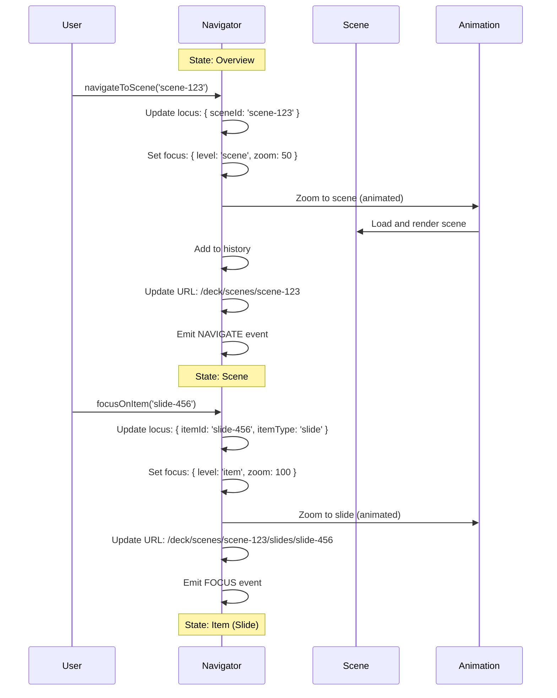
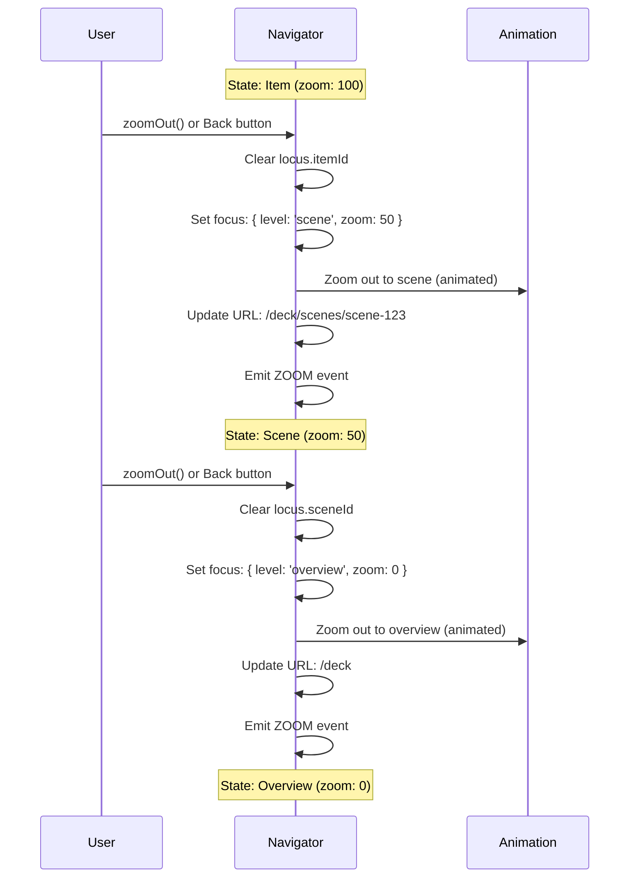
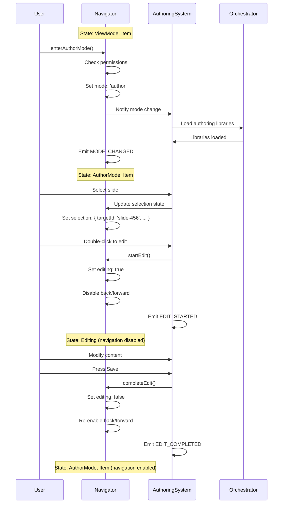

# Spec 03: Navigator State & Flows

**Initiative**: Authoring-Viewing Unification  
**Date**: October 14, 2025  
**Status**: Planning Phase  
**Type**: Core Contract Specification  
**Depends On**: [Spec 00](./00-project-context.md), [Spec 01](./01-module-integration.md), [Spec 02](./02-event-taxonomy.md)

---

## Overview

This specification defines enhancements to Protogen's existing Navigator system to support authoring mode, deck→scene→slide/page flows, and zoom-based focus navigation. All changes extend the current Navigator without breaking existing functionality.

**Principle**: Navigator state is the single source of truth for the user's current location and mode.

---

## Existing Navigator System

### Current State Model

```typescript
// Current NavigatorState (from existing system)
interface NavigatorState {
  currentContext: {
    path: string;
    sceneId?: string;
    deckId?: string;
  };
  history: NavigationEntry[];
  historyIndex: number;
}

interface NavigationEntry {
  path: string;
  sceneId?: string;
  deckId?: string;
  timestamp: number;
}
```

### Current Navigator Methods

```typescript
class NavigatorSystem {
  // Existing methods (preserved)
  navigateTo(path: string): void;
  navigateToScene(sceneId: string): void;
  navigateToDeck(deckId: string, sceneIndex?: number): void;
  back(): void;
  forward(): void;
  getCurrentContext(): CurrentContext;
  getHistory(): NavigationEntry[];
}
```

---

## Enhanced State Model

### Extended NavigatorState

```typescript
interface NavigatorState {
  // Existing fields (unchanged)
  currentContext: {
    path: string;
    sceneId?: string;
    deckId?: string;
  };
  history: NavigationEntry[];
  historyIndex: number;
  
  // ✨ NEW: Authoring mode
  mode: 'view' | 'author';
  
  // ✨ NEW: Item-level navigation (locus)
  locus: NavigationLocus;
  
  // ✨ NEW: Zoom/focus state
  focus: FocusState;
  
  // ✨ NEW: Selection tracking
  selection: SelectionState | null;
  
  // ✨ NEW: ToC drawer state
  tocOpen: boolean;
}

interface NavigationLocus {
  deckId?: string;
  sceneId?: string;
  itemId?: string;         // slide, page, or node ID
  itemType?: ItemType;     // 'slide' | 'page' | 'node'
  coordinate?: Coordinate; // For graph scenes
}

interface FocusState {
  level: 'overview' | 'scene' | 'item';
  zoomLevel: number;       // 0-100 scale
  target?: {
    itemId: string;
    itemType: ItemType;
  };
  animated: boolean;       // Use animation for transitions
}

interface Coordinate {
  x: number;
  y: number;
  z?: number;
}

type ItemType = 'slide' | 'page' | 'node' | 'edge' | 'block';
```

### Extended NavigationEntry

```typescript
interface NavigationEntry {
  // Existing fields
  path: string;
  sceneId?: string;
  deckId?: string;
  timestamp: number;
  
  // ✨ NEW: Extended tracking
  mode?: 'view' | 'author';
  locus?: NavigationLocus;
  focusLevel?: 'overview' | 'scene' | 'item';
  zoomLevel?: number;
}
```

---

## State Machine

### Navigator State Transitions

```mermaid
statechart-v2
  [*] --> ViewMode
  
  ViewMode --> AuthorMode : enterAuthorMode()
  AuthorMode --> ViewMode : exitAuthorMode()
  
  state ViewMode {
    [*] --> Overview
    Overview --> Scene : navigateToScene()
    Scene --> Item : focusOnItem()
    Item --> Scene : zoomOut()
    Scene --> Overview : zoomOut()
    
    Overview --> Overview : navigateTo()
    Scene --> Scene : navigateToScene()
    Item --> Item : navigateToItem()
  }
  
  state AuthorMode {
    [*] --> Overview_A
    Overview_A --> Scene_A : navigateToScene()
    Scene_A --> Item_A : focusOnItem()
    Item_A --> Scene_A : zoomOut()
    Scene_A --> Overview_A : zoomOut()
    
    Item_A --> Editing : startEdit()
    Editing --> Item_A : completeEdit()
    Editing --> Item_A : cancelEdit()
  }
```

### Transition Table

| Current State | Action | Next State | Guards | Side Effects |
|--------------|--------|------------|--------|--------------|
| ViewMode | `enterAuthorMode()` | AuthorMode | User has permission | Load authoring libs, emit MODE_CHANGED |
| AuthorMode | `exitAuthorMode()` | ViewMode | No unsaved changes | Unload authoring libs, emit MODE_CHANGED |
| Overview | `navigateToScene(id)` | Scene | Scene exists | Load scene, update URL, add history |
| Scene | `focusOnItem(id)` | Item | Item exists | Zoom animation, emit FOCUS, update locus |
| Item | `zoomOut()` | Scene | - | Zoom animation, clear locus.itemId |
| Scene | `zoomOut()` | Overview | - | Zoom animation, clear locus.sceneId |
| AuthorMode/Item | `startEdit()` | Editing | Selection active | Disable navigation, emit EDIT_STARTED |
| Editing | `completeEdit()` | Item | - | Re-enable navigation, emit EDIT_COMPLETED |
| Editing | `cancelEdit()` | Item | - | Re-enable navigation, emit EDIT_CANCELED |

---

## Navigation Flows

### Flow 1: Deck → Scene → Slide

**User Journey**: Browse deck overview → click scene → click slide



### Flow 2: Zoom Out (Item → Scene → Overview)

**User Journey**: Viewing slide → back to scene → back to overview



### Flow 3: Enter Author Mode → Edit → Save

**User Journey**: Toggle to author mode → select item → edit → save



---

## Enhanced Navigator Methods

### Mode Management

```typescript
class NavigatorSystem {
  // ✨ NEW: Authoring mode
  enterAuthorMode(): void {
    if (!this.canEnterAuthorMode()) {
      throw new Error('Insufficient permissions');
    }
    
    const previousMode = this.state.mode;
    this.state.mode = 'author';
    
    this.emit('MODE_CHANGED', {
      previousMode,
      currentMode: 'author',
      timestamp: Date.now(),
      triggeredBy: 'user'
    });
    
    this.orchestrator.loadAuthoringLibraries();
  }
  
  exitAuthorMode(): void {
    if (this.hasUnsavedChanges()) {
      // Prompt user or auto-save
    }
    
    const previousMode = this.state.mode;
    this.state.mode = 'view';
    
    this.emit('MODE_CHANGED', {
      previousMode,
      currentMode: 'view',
      timestamp: Date.now(),
      triggeredBy: 'user'
    });
    
    this.orchestrator.unloadAuthoringLibraries();
  }
  
  toggleMode(): void {
    if (this.state.mode === 'view') {
      this.enterAuthorMode();
    } else {
      this.exitAuthorMode();
    }
  }
  
  getMode(): 'view' | 'author' {
    return this.state.mode;
  }
  
  private canEnterAuthorMode(): boolean {
    // Check user permissions
    return this.authService.hasPermission('authoring.access');
  }
  
  private hasUnsavedChanges(): boolean {
    // Check with authoring system
    return this.authoringSystem.hasUnsavedChanges();
  }
}
```

### Item Navigation

```typescript
class NavigatorSystem {
  // ✨ NEW: Navigate to specific item (slide/page/node)
  navigateToItem(itemId: string, itemType: ItemType): void {
    this.state.locus.itemId = itemId;
    this.state.locus.itemType = itemType;
    
    this.updateFocus({
      level: 'item',
      zoomLevel: 100,
      target: { itemId, itemType },
      animated: true
    });
    
    this.updateURL();
    this.addToHistory();
    
    this.emit('NAVIGATE', {
      path: this.getCurrentPath(),
      sceneId: this.state.locus.sceneId,
      deckId: this.state.locus.deckId,
      itemId,
      itemType,
      authoringMode: this.state.mode === 'author'
    });
  }
  
  getCurrentItem(): { id: string; type: ItemType } | null {
    if (!this.state.locus.itemId) return null;
    
    return {
      id: this.state.locus.itemId,
      type: this.state.locus.itemType!
    };
  }
  
  // ✨ NEW: Navigate within collection (next/prev slide/page)
  nextItem(): void {
    const current = this.getCurrentItem();
    if (!current) return;
    
    const nextId = this.sceneSystem.getNextItem(
      this.state.locus.sceneId!,
      current.id
    );
    
    if (nextId) {
      this.navigateToItem(nextId, current.type);
    }
  }
  
  previousItem(): void {
    const current = this.getCurrentItem();
    if (!current) return;
    
    const prevId = this.sceneSystem.getPreviousItem(
      this.state.locus.sceneId!,
      current.id
    );
    
    if (prevId) {
      this.navigateToItem(prevId, current.type);
    }
  }
}
```

### Zoom & Focus

```typescript
class NavigatorSystem {
  // ✨ NEW: Zoom to specific item with animation
  async focusOnItem(itemId: string, itemType: ItemType): Promise<void> {
    const previousFocus = { ...this.state.focus };
    
    this.state.locus.itemId = itemId;
    this.state.locus.itemType = itemType;
    
    this.updateFocus({
      level: 'item',
      zoomLevel: 100,
      target: { itemId, itemType },
      animated: true
    });
    
    this.emit('FOCUS', {
      sceneId: this.state.locus.sceneId!,
      itemId,
      itemType,
      previousFocus: previousFocus.target,
      zoomLevel: 100,
      animated: true
    });
    
    await this.animateZoom(previousFocus.zoomLevel, 100);
    this.updateURL();
  }
  
  // ✨ NEW: Zoom out one level
  async zoomOut(): Promise<void> {
    const previousZoom = this.state.focus.zoomLevel;
    let targetZoom = 0;
    
    if (this.state.focus.level === 'item') {
      // Item → Scene
      this.state.locus.itemId = undefined;
      this.state.locus.itemType = undefined;
      this.updateFocus({ level: 'scene', zoomLevel: 50 });
      targetZoom = 50;
    } else if (this.state.focus.level === 'scene') {
      // Scene → Overview
      this.state.locus.sceneId = undefined;
      this.updateFocus({ level: 'overview', zoomLevel: 0 });
      targetZoom = 0;
    }
    
    this.emit('ZOOM', {
      sceneId: this.state.locus.sceneId || '',
      previousZoom,
      currentZoom: targetZoom,
      target: this.state.focus.target
    });
    
    await this.animateZoom(previousZoom, targetZoom);
    this.updateURL();
  }
  
  // ✨ NEW: Set zoom level directly (0-100)
  async setZoomLevel(level: number): Promise<void> {
    const previousZoom = this.state.focus.zoomLevel;
    this.state.focus.zoomLevel = Math.max(0, Math.min(100, level));
    
    this.emit('ZOOM', {
      sceneId: this.state.locus.sceneId || '',
      previousZoom,
      currentZoom: this.state.focus.zoomLevel,
      target: this.state.focus.target
    });
    
    if (this.state.focus.animated) {
      await this.animateZoom(previousZoom, this.state.focus.zoomLevel);
    }
  }
  
  private async animateZoom(from: number, to: number): Promise<void> {
    // Smooth zoom animation using requestAnimationFrame
    return new Promise(resolve => {
      const duration = 300; // ms
      const startTime = performance.now();
      
      const animate = (currentTime: number) => {
        const elapsed = currentTime - startTime;
        const progress = Math.min(elapsed / duration, 1);
        
        // Ease-in-out
        const eased = progress < 0.5
          ? 2 * progress * progress
          : 1 - Math.pow(-2 * progress + 2, 2) / 2;
        
        const currentZoom = from + (to - from) * eased;
        this.sceneRenderer.setZoom(currentZoom);
        
        if (progress < 1) {
          requestAnimationFrame(animate);
        } else {
          resolve();
        }
      };
      
      requestAnimationFrame(animate);
    });
  }
  
  private updateFocus(partial: Partial<FocusState>): void {
    this.state.focus = {
      ...this.state.focus,
      ...partial
    };
  }
}
```

### Selection Integration

```typescript
class NavigatorSystem {
  // ✨ NEW: Track selection in navigator state
  updateSelection(selection: SelectionState | null): void {
    this.state.selection = selection;
    
    // Optionally focus on selected item
    if (selection && selection.targetId) {
      this.focusOnItem(selection.targetId, selection.targetType);
    }
  }
  
  clearSelection(): void {
    this.state.selection = null;
  }
  
  getSelection(): SelectionState | null {
    return this.state.selection;
  }
}
```

---

## URL Synchronization

### URL Structure

**Extended URL patterns** for authoring:

```
View Mode:
/                              (overview)
/deck/:deckId                  (deck overview)
/deck/:deckId/scenes/:sceneId  (scene view)

Author Mode:
/author                                        (overview in author mode)
/author/deck/:deckId                           (deck overview in author mode)
/author/deck/:deckId/scenes/:sceneId           (scene in author mode)
/author/deck/:deckId/scenes/:sceneId/items/:itemId  (item focused)

Query Parameters:
?zoom=50                       (zoom level)
?mode=author                   (alternative to /author prefix)
?x=100&y=200&z=5              (coordinate for graph scenes)
```

### URL Sync Service Updates

```typescript
class URLSyncService {
  // ✨ ENHANCED: Include authoring state
  syncContextToURL(context: NavigatorState): void {
    let path = '/';
    
    // Mode prefix
    if (context.mode === 'author') {
      path += 'author/';
    }
    
    // Deck
    if (context.locus.deckId) {
      path += `deck/${context.locus.deckId}/`;
    }
    
    // Scene
    if (context.locus.sceneId) {
      path += `scenes/${context.locus.sceneId}/`;
    }
    
    // Item
    if (context.locus.itemId) {
      path += `items/${context.locus.itemId}`;
    }
    
    // Query params
    const params = new URLSearchParams();
    if (context.focus.zoomLevel !== 0) {
      params.set('zoom', context.focus.zoomLevel.toString());
    }
    if (context.locus.coordinate) {
      params.set('x', context.locus.coordinate.x.toString());
      params.set('y', context.locus.coordinate.y.toString());
      if (context.locus.coordinate.z !== undefined) {
        params.set('z', context.locus.coordinate.z.toString());
      }
    }
    
    const search = params.toString();
    const url = search ? `${path}?${search}` : path;
    
    window.history.pushState({ context }, '', url);
    this.emit('url-changed', { url, context });
  }
  
  // ✨ ENHANCED: Parse authoring URLs
  syncURLToContext(url: string): NavigatorState {
    const urlObj = new URL(url, window.location.origin);
    const parts = urlObj.pathname.split('/').filter(Boolean);
    const params = new URLSearchParams(urlObj.search);
    
    const state: NavigatorState = {
      mode: parts[0] === 'author' ? 'author' : 'view',
      locus: {},
      focus: {
        level: 'overview',
        zoomLevel: parseInt(params.get('zoom') || '0'),
        animated: false
      },
      selection: null,
      tocOpen: false,
      // ... other state
    };
    
    // Parse path (accounting for optional 'author' prefix)
    const offset = state.mode === 'author' ? 1 : 0;
    
    if (parts[offset] === 'deck' && parts[offset + 1]) {
      state.locus.deckId = parts[offset + 1];
      state.focus.level = 'overview';
    }
    
    if (parts[offset + 2] === 'scenes' && parts[offset + 3]) {
      state.locus.sceneId = parts[offset + 3];
      state.focus.level = 'scene';
    }
    
    if (parts[offset + 4] === 'items' && parts[offset + 5]) {
      state.locus.itemId = parts[offset + 5];
      state.locus.itemType = this.inferItemType(state.locus.sceneId!);
      state.focus.level = 'item';
    }
    
    // Parse coordinates
    if (params.has('x') && params.has('y')) {
      state.locus.coordinate = {
        x: parseFloat(params.get('x')!),
        y: parseFloat(params.get('y')!),
        z: params.has('z') ? parseFloat(params.get('z')!) : undefined
      };
    }
    
    return state;
  }
}
```

---

## History Management

### Enhanced History Tracking

```typescript
class NavigatorSystem {
  // ✨ ENHANCED: Store full navigation state in history
  private addToHistory(): void {
    // Remove any forward history
    this.state.history = this.state.history.slice(0, this.state.historyIndex + 1);
    
    // Add new entry with full state
    const entry: NavigationEntry = {
      path: this.getCurrentPath(),
      sceneId: this.state.locus.sceneId,
      deckId: this.state.locus.deckId,
      timestamp: Date.now(),
      mode: this.state.mode,
      locus: { ...this.state.locus },
      focusLevel: this.state.focus.level,
      zoomLevel: this.state.focus.zoomLevel
    };
    
    this.state.history.push(entry);
    this.state.historyIndex++;
    
    // Limit history size
    const maxHistory = 100;
    if (this.state.history.length > maxHistory) {
      this.state.history.shift();
      this.state.historyIndex--;
    }
  }
  
  // ✨ ENHANCED: Restore full state on back/forward
  back(): void {
    if (this.state.historyIndex <= 0) return;
    
    this.state.historyIndex--;
    const entry = this.state.history[this.state.historyIndex];
    
    this.restoreFromHistoryEntry(entry);
  }
  
  forward(): void {
    if (this.state.historyIndex >= this.state.history.length - 1) return;
    
    this.state.historyIndex++;
    const entry = this.state.history[this.state.historyIndex];
    
    this.restoreFromHistoryEntry(entry);
  }
  
  private restoreFromHistoryEntry(entry: NavigationEntry): void {
    // Restore mode
    if (entry.mode && entry.mode !== this.state.mode) {
      if (entry.mode === 'author') {
        this.enterAuthorMode();
      } else {
        this.exitAuthorMode();
      }
    }
    
    // Restore locus
    this.state.locus = { ...entry.locus };
    
    // Restore focus
    this.state.focus.level = entry.focusLevel || 'overview';
    this.state.focus.zoomLevel = entry.zoomLevel || 0;
    
    // Emit navigate event
    this.emit('NAVIGATE', {
      path: entry.path,
      sceneId: entry.sceneId,
      deckId: entry.deckId,
      itemId: entry.locus?.itemId,
      itemType: entry.locus?.itemType,
      authoringMode: entry.mode === 'author'
    });
    
    // Update URL
    this.updateURL();
  }
}
```

---

## Integration with Existing Systems

### With Scene System

```typescript
// Scene system provides item navigation helpers
interface SceneSystem {
  getNextItem(sceneId: string, currentItemId: string): string | null;
  getPreviousItem(sceneId: string, currentItemId: string): string | null;
  getItemCount(sceneId: string): number;
  getItemType(sceneId: string): ItemType;
}
```

### With Authoring System

```typescript
// Authoring system listens to Navigator mode changes
class AuthoringSystem {
  constructor(private navigator: NavigatorSystem) {
    navigator.on('MODE_CHANGED', this.handleModeChange.bind(this));
  }
  
  private handleModeChange(payload: ModeChangedPayload): void {
    if (payload.currentMode === 'author') {
      this.activate();
    } else {
      this.deactivate();
    }
  }
}
```

### With Toolbar System

```typescript
// Toolbar shows mode toggle and zoom controls in author mode
class ToolbarSystem {
  constructor(private navigator: NavigatorSystem) {
    navigator.on('MODE_CHANGED', this.updateToolbar.bind(this));
    navigator.on('ZOOM', this.updateZoomIndicator.bind(this));
  }
}
```

---

## Testing Strategy

### Unit Tests

```typescript
describe('Navigator Authoring Mode', () => {
  it('should enter author mode with permissions', () => {
    navigator.enterAuthorMode();
    expect(navigator.getMode()).toBe('author');
  });
  
  it('should emit MODE_CHANGED event', () => {
    const handler = jest.fn();
    navigator.on('MODE_CHANGED', handler);
    
    navigator.enterAuthorMode();
    
    expect(handler).toHaveBeenCalledWith({
      previousMode: 'view',
      currentMode: 'author',
      timestamp: expect.any(Number),
      triggeredBy: 'user'
    });
  });
  
  it('should throw error without permissions', () => {
    mockPermissions({ 'authoring.access': false });
    expect(() => navigator.enterAuthorMode()).toThrow();
  });
});

describe('Navigator Item Navigation', () => {
  it('should navigate to specific item', () => {
    navigator.navigateToItem('slide-123', 'slide');
    
    const current = navigator.getCurrentItem();
    expect(current).toEqual({
      id: 'slide-123',
      type: 'slide'
    });
  });
  
  it('should update focus level to item', () => {
    navigator.navigateToItem('slide-123', 'slide');
    expect(navigator.state.focus.level).toBe('item');
    expect(navigator.state.focus.zoomLevel).toBe(100);
  });
});

describe('Navigator Zoom', () => {
  it('should zoom out from item to scene', async () => {
    navigator.navigateToItem('slide-123', 'slide');
    await navigator.zoomOut();
    
    expect(navigator.state.focus.level).toBe('scene');
    expect(navigator.state.locus.itemId).toBeUndefined();
  });
  
  it('should emit ZOOM event', async () => {
    const handler = jest.fn();
    navigator.on('ZOOM', handler);
    
    await navigator.zoomOut();
    
    expect(handler).toHaveBeenCalledWith({
      sceneId: expect.any(String),
      previousZoom: 100,
      currentZoom: 50,
      target: expect.any(Object)
    });
  });
});
```

### Integration Tests

```typescript
describe('Navigator Integration', () => {
  it('should complete full navigation flow', async () => {
    // Overview → Scene → Item → Edit → Save → Zoom Out
    navigator.navigateToScene('scene-123');
    expect(navigator.state.focus.level).toBe('scene');
    
    navigator.focusOnItem('slide-456', 'slide');
    expect(navigator.state.focus.level).toBe('item');
    
    navigator.enterAuthorMode();
    expect(navigator.getMode()).toBe('author');
    
    await authoringSystem.editItem();
    expect(navigator.state.editing).toBe(true);
    
    await authoringSystem.saveEdit();
    expect(navigator.state.editing).toBe(false);
    
    await navigator.zoomOut();
    expect(navigator.state.focus.level).toBe('scene');
  });
});
```

---

## Acceptance Criteria

- [x] Navigator state model extended with mode, locus, focus, selection
- [x] State machine diagram for mode and focus transitions
- [x] Transition table with guards and side effects
- [x] Three navigation flow sequence diagrams
- [x] Mode management methods (enter/exit/toggle)
- [x] Item navigation methods (navigate, next, prev)
- [x] Zoom and focus methods with animation
- [x] Selection integration
- [x] Enhanced URL synchronization
- [x] History management with full state restoration
- [x] Integration points documented
- [x] Testing strategy with examples
- [x] Backward compatibility maintained

**Status**: ✅ Complete - Ready for Spec 04

---

## References

- **Previous**: [Spec 02: Event Taxonomy](./02-event-taxonomy.md)
- **Next**: [Spec 04: Authoring Overlay Framework](./04-authoring-overlay.md)
- **Related**: Existing Navigator system in `shared/src/systems/navigator/`

---

## Changelog

**2025-10-14**: Initial specification created  
**Status**: Ready for stakeholder review

