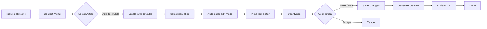
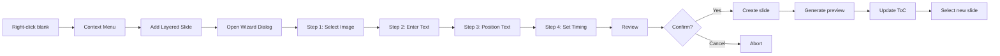

# Spec 09: Card Scene Type

**Initiative**: Authoring-Viewing Unification  
**Date**: October 14, 2025  
**Status**: Planning Phase  
**Type**: Scene Type Specification  
**Depends On**: [Spec 04](./04-authoring-overlay.md), [Spec 05](./05-context-menu.md), [Spec 06](./06-highlighting-strategies.md)

---

## Overview

This specification defines the Card scene type for slide-based presentations. Card scenes support text-only, image-only, and layered (image + text) slides with timing controls for animations.

**Purpose**: Simple, beautiful slide presentations with three slide variants.

---

## Data Models

### Card Scene Schema

```typescript
interface CardScene extends Scene {
  scene_type: 'card';
  config: CardSceneConfig;
  slides: CardSlide[];
}

interface CardSceneConfig {
  defaultTransition: TransitionType;
  autoAdvance: boolean;
  autoAdvanceDelay: number;      // ms between slides
  loop: boolean;
  theme: CardThemeConfig;
}

interface CardThemeConfig {
  defaultBackground: string;      // Solid color or gradient
  defaultTextColor: string;
  defaultFontFamily: string;
  defaultFontSize: number;
  defaultAlignment: 'left' | 'center' | 'right';
}

type TransitionType = 'none' | 'fade' | 'slide' | 'zoom';
```

### Slide Variants

#### Text Slide

```typescript
interface TextSlide {
  id: string;
  kind: 'text';
  order: number;
  
  // Text content
  text: string;
  fontSize: number;            // 12-128
  fontFamily?: string;
  alignment: 'left' | 'center' | 'right';
  
  // Styling
  textColor: string;
  backgroundColor: string;     // Solid color or gradient
  padding: number;             // px
  
  // Metadata
  title?: string;              // For ToC
  notes?: string;              // Speaker notes
  duration?: number;           // For auto-advance (ms)
}
```

**JSON Schema**:
```json
{
  "type": "object",
  "properties": {
    "id": { "type": "string" },
    "kind": { "const": "text" },
    "order": { "type": "number", "minimum": 0 },
    "text": { "type": "string", "maxLength": 500 },
    "fontSize": { "type": "number", "minimum": 12, "maximum": 128 },
    "fontFamily": { "type": "string" },
    "alignment": { "enum": ["left", "center", "right"] },
    "textColor": { "type": "string", "pattern": "^#[0-9A-Fa-f]{6}$" },
    "backgroundColor": { "type": "string" },
    "padding": { "type": "number", "minimum": 0 },
    "title": { "type": "string", "maxLength": 100 },
    "notes": { "type": "string" },
    "duration": { "type": "number", "minimum": 0 }
  },
  "required": ["id", "kind", "order", "text", "fontSize", "alignment", "textColor", "backgroundColor"]
}
```

#### Image Slide

```typescript
interface ImageSlide {
  id: string;
  kind: 'image';
  order: number;
  
  // Image content
  imageAssetId: string;
  fit: 'contain' | 'cover' | 'fill';
  position: { x: number; y: number };  // % for positioning
  
  // Optional caption
  caption?: {
    text: string;
    position: 'top' | 'bottom';
    backgroundColor: string;
    textColor: string;
  };
  
  // Metadata
  title?: string;
  notes?: string;
  duration?: number;
}
```

**JSON Schema**:
```json
{
  "type": "object",
  "properties": {
    "id": { "type": "string" },
    "kind": { "const": "image" },
    "order": { "type": "number" },
    "imageAssetId": { "type": "string" },
    "fit": { "enum": ["contain", "cover", "fill"] },
    "position": {
      "type": "object",
      "properties": {
        "x": { "type": "number", "minimum": 0, "maximum": 100 },
        "y": { "type": "number", "minimum": 0, "maximum": 100 }
      }
    },
    "caption": {
      "type": "object",
      "properties": {
        "text": { "type": "string", "maxLength": 200 },
        "position": { "enum": ["top", "bottom"] },
        "backgroundColor": { "type": "string" },
        "textColor": { "type": "string" }
      }
    },
    "title": { "type": "string" },
    "notes": { "type": "string" },
    "duration": { "type": "number" }
  },
  "required": ["id", "kind", "order", "imageAssetId", "fit"]
}
```

#### Layered Slide

```typescript
interface LayeredSlide {
  id: string;
  kind: 'layered';
  order: number;
  
  // Background layer
  backgroundImageId: string;
  backgroundFit: 'contain' | 'cover';
  backgroundDim: number;         // 0-100 (darkening overlay)
  
  // Text layer
  text: string;
  fontSize: number;
  fontFamily?: string;
  alignment: 'left' | 'center' | 'right';
  textColor: string;
  textPosition: {
    vertical: 'top' | 'center' | 'bottom';
    horizontal: 'left' | 'center' | 'right';
  };
  
  // Timing/animation
  textTiming: {
    delay: number;               // ms before text appears
    duration: number;            // ms for enter animation
    animation: AnimationType;
  };
  
  // Metadata
  title?: string;
  notes?: string;
  duration?: number;             // Total slide duration
}

type AnimationType = 'none' | 'fade' | 'slide-up' | 'slide-down' | 'zoom';
```

**JSON Schema**:
```json
{
  "type": "object",
  "properties": {
    "id": { "type": "string" },
    "kind": { "const": "layered" },
    "order": { "type": "number" },
    "backgroundImageId": { "type": "string" },
    "backgroundFit": { "enum": ["contain", "cover"] },
    "backgroundDim": { "type": "number", "minimum": 0, "maximum": 100 },
    "text": { "type": "string", "maxLength": 300 },
    "fontSize": { "type": "number", "minimum": 12, "maximum": 128 },
    "textColor": { "type": "string" },
    "textPosition": {
      "type": "object",
      "properties": {
        "vertical": { "enum": ["top", "center", "bottom"] },
        "horizontal": { "enum": ["left", "center", "right"] }
      },
      "required": ["vertical", "horizontal"]
    },
    "textTiming": {
      "type": "object",
      "properties": {
        "delay": { "type": "number", "minimum": 0 },
        "duration": { "type": "number", "minimum": 0 },
        "animation": { "enum": ["none", "fade", "slide-up", "slide-down", "zoom"] }
      },
      "required": ["delay", "duration", "animation"]
    }
  },
  "required": ["id", "kind", "order", "backgroundImageId", "text", "textTiming"]
}
```

---

## Authoring Actions

### Context Menu Actions

Defined in Spec 05, summarized here:

**On Text Slide**:
- Edit Text (Enter) → Inline editor
- Edit Timing... → Drawer property inspector
- Change Alignment → Submenu (left/center/right)
- Remove Slide (Delete) → Confirmation dialog

**On Image Slide**:
- Replace Image... → File picker
- Crop Image... → Modal image cropper
- Add Caption → Inline caption editor
- Remove Slide (Delete) → Confirmation dialog

**On Layered Slide**:
- Edit Text Layer → Inline text editor
- Change Background... → File picker
- Text Animation... → Drawer timing editor
- Layer Order... → Layer controls
- Remove Slide (Delete) → Confirmation dialog

**On Blank Space**:
- Add Text Slide (T) → Create text slide
- Add Image Slide (I) → File picker + create
- Add Layered Slide (L) → Wizard dialog
- Paste Slide (Ctrl+V) → Paste from clipboard

---

## Property Inspector Schema

### Text Slide Inspector

```typescript
const textSlideInspectorSchema: InspectorSchema = {
  fields: [
    {
      id: 'text',
      label: 'Text',
      type: 'textarea',
      rows: 4,
      validation: [
        { type: 'required' },
        { type: 'maxLength', value: 500 }
      ]
    },
    {
      id: 'fontSize',
      label: 'Font Size',
      type: 'range',
      min: 12,
      max: 128,
      step: 2,
      defaultValue: 24
    },
    {
      id: 'alignment',
      label: 'Alignment',
      type: 'segmented-control',
      options: [
        { value: 'left', label: 'Left', icon: 'align-left' },
        { value: 'center', label: 'Center', icon: 'align-center' },
        { value: 'right', label: 'Right', icon: 'align-right' }
      ]
    },
    {
      id: 'textColor',
      label: 'Text Color',
      type: 'color',
      defaultValue: '#000000'
    },
    {
      id: 'backgroundColor',
      label: 'Background',
      type: 'color-or-gradient',
      defaultValue: '#ffffff'
    },
    {
      id: 'padding',
      label: 'Padding',
      type: 'range',
      min: 0,
      max: 100,
      step: 5,
      unit: 'px',
      defaultValue: 40
    }
  ],
  layout: 'vertical',
  sections: [
    { title: 'Content', fields: ['text'] },
    { title: 'Typography', fields: ['fontSize', 'alignment'] },
    { title: 'Colors', fields: ['textColor', 'backgroundColor'] },
    { title: 'Spacing', fields: ['padding'] }
  ]
};
```

### Layered Slide Inspector

```typescript
const layeredSlideInspectorSchema: InspectorSchema = {
  fields: [
    // Background tab
    {
      id: 'backgroundImageId',
      label: 'Background Image',
      type: 'image-picker',
      validation: [{ type: 'required' }]
    },
    {
      id: 'backgroundFit',
      label: 'Background Fit',
      type: 'select',
      options: [
        { value: 'contain', label: 'Contain' },
        { value: 'cover', label: 'Cover' }
      ]
    },
    {
      id: 'backgroundDim',
      label: 'Darken Background',
      type: 'range',
      min: 0,
      max: 100,
      step: 5,
      unit: '%',
      defaultValue: 30
    },
    
    // Text tab
    {
      id: 'text',
      label: 'Text Overlay',
      type: 'textarea',
      rows: 3,
      validation: [
        { type: 'required' },
        { type: 'maxLength', value: 300 }
      ]
    },
    {
      id: 'fontSize',
      label: 'Font Size',
      type: 'range',
      min: 16,
      max: 128,
      defaultValue: 36
    },
    {
      id: 'textColor',
      label: 'Text Color',
      type: 'color',
      defaultValue: '#ffffff'
    },
    {
      id: 'textPosition.vertical',
      label: 'Vertical Position',
      type: 'segmented-control',
      options: [
        { value: 'top', label: 'Top' },
        { value: 'center', label: 'Center' },
        { value: 'bottom', label: 'Bottom' }
      ]
    },
    {
      id: 'textPosition.horizontal',
      label: 'Horizontal Position',
      type: 'segmented-control',
      options: [
        { value: 'left', label: 'Left' },
        { value: 'center', label: 'Center' },
        { value: 'right', label: 'Right' }
      ]
    },
    
    // Animation tab
    {
      id: 'textTiming.delay',
      label: 'Appear After',
      type: 'number',
      min: 0,
      max: 10000,
      step: 100,
      unit: 'ms',
      defaultValue: 500
    },
    {
      id: 'textTiming.duration',
      label: 'Animation Duration',
      type: 'number',
      min: 0,
      max: 5000,
      step: 100,
      unit: 'ms',
      defaultValue: 800
    },
    {
      id: 'textTiming.animation',
      label: 'Animation Type',
      type: 'select',
      options: [
        { value: 'none', label: 'None' },
        { value: 'fade', label: 'Fade In' },
        { value: 'slide-up', label: 'Slide Up' },
        { value: 'slide-down', label: 'Slide Down' },
        { value: 'zoom', label: 'Zoom In' }
      ],
      defaultValue: 'fade'
    }
  ],
  layout: 'tabs',
  tabs: [
    { id: 'background', title: 'Background', fields: ['backgroundImageId', 'backgroundFit', 'backgroundDim'] },
    { id: 'text', title: 'Text', fields: ['text', 'fontSize', 'textColor', 'textPosition.vertical', 'textPosition.horizontal'] },
    { id: 'animation', title: 'Animation', fields: ['textTiming.delay', 'textTiming.duration', 'textTiming.animation'] }
  ]
};
```

---

## Rendering

### Text Slide Renderer

```typescript
function TextSlideRenderer({ slide }: { slide: TextSlide }) {
  return (
    <div
      className="card-slide text-slide"
      style={{
        background: slide.backgroundColor,
        padding: `${slide.padding}px`,
        display: 'flex',
        alignItems: 'center',
        justifyContent: 'center',
        minHeight: '100%'
      }}
    >
      <div
        className="slide-text"
        style={{
          color: slide.textColor,
          fontSize: `${slide.fontSize}px`,
          fontFamily: slide.fontFamily,
          textAlign: slide.alignment,
          maxWidth: '80%'
        }}
      >
        {slide.text}
      </div>
    </div>
  );
}
```

### Image Slide Renderer

```typescript
function ImageSlideRenderer({ slide }: { slide: ImageSlide }) {
  const imageUrl = useAssetUrl(slide.imageAssetId);
  
  return (
    <div
      className="card-slide image-slide"
      style={{
        position: 'relative',
        width: '100%',
        height: '100%',
        overflow: 'hidden'
      }}
    >
      
      
      {slide.caption && (
        <div
          className="image-caption"
          style={{
            position: 'absolute',
            [slide.caption.position]: 0,
            width: '100%',
            padding: '16px',
            backgroundColor: slide.caption.backgroundColor,
            color: slide.caption.textColor,
            textAlign: 'center'
          }}
        >
          {slide.caption.text}
        </div>
      )}
    </div>
  );
}
```

### Layered Slide Renderer

```typescript
function LayeredSlideRenderer({ slide }: { slide: LayeredSlide }) {
  const [textVisible, setTextVisible] = useState(false);
  const backgroundUrl = useAssetUrl(slide.backgroundImageId);
  
  // Trigger text animation after delay
  useEffect(() => {
    const timer = setTimeout(() => {
      setTextVisible(true);
    }, slide.textTiming.delay);
    
    return () => clearTimeout(timer);
  }, [slide.id, slide.textTiming.delay]);
  
  return (
    <div
      className="card-slide layered-slide"
      style={{
        position: 'relative',
        width: '100%',
        height: '100%',
        overflow: 'hidden'
      }}
    >
      {/* Background layer */}
      <div
        className="background-layer"
        style={{
          position: 'absolute',
          inset: 0,
          backgroundImage: `url(${backgroundUrl})`,
          backgroundSize: slide.backgroundFit,
          backgroundPosition: 'center',
          backgroundRepeat: 'no-repeat'
        }}
      />
      
      {/* Dim overlay */}
      {slide.backgroundDim > 0 && (
        <div
          className="dim-overlay"
          style={{
            position: 'absolute',
            inset: 0,
            backgroundColor: `rgba(0, 0, 0, ${slide.backgroundDim / 100})`
          }}
        />
      )}
      
      {/* Text layer */}
      <div
        className={`text-layer ${textVisible ? 'visible' : 'hidden'}`}
        style={{
          position: 'absolute',
          inset: 0,
          display: 'flex',
          alignItems: getVerticalAlignment(slide.textPosition.vertical),
          justifyContent: getHorizontalAlignment(slide.textPosition.horizontal),
          padding: '40px'
        }}
      >
        <div
          className={`layered-text animation-${slide.textTiming.animation}`}
          style={{
            color: slide.textColor,
            fontSize: `${slide.fontSize}px`,
            fontFamily: slide.fontFamily,
            textAlign: slide.alignment,
            textShadow: '0 2px 8px rgba(0, 0, 0, 0.3)',  // Readability
            animationDuration: `${slide.textTiming.duration}ms`,
            maxWidth: '80%'
          }}
        >
          {slide.text}
        </div>
      </div>
    </div>
  );
}

function getVerticalAlignment(pos: 'top' | 'center' | 'bottom'): string {
  switch (pos) {
    case 'top': return 'flex-start';
    case 'center': return 'center';
    case 'bottom': return 'flex-end';
  }
}

function getHorizontalAlignment(pos: 'left' | 'center' | 'right'): string {
  switch (pos) {
    case 'left': return 'flex-start';
    case 'center': return 'center';
    case 'right': return 'flex-end';
  }
}
```

---

## Animations (Declarative)

### Animation CSS

```css
/* Fade animation */
@keyframes fade-in {
  from {
    opacity: 0;
  }
  to {
    opacity: 1;
  }
}

.animation-fade {
  animation-name: fade-in;
  animation-fill-mode: both;
}

/* Slide up animation */
@keyframes slide-up {
  from {
    opacity: 0;
    transform: translateY(40px);
  }
  to {
    opacity: 1;
    transform: translateY(0);
  }
}

.animation-slide-up {
  animation-name: slide-up;
  animation-fill-mode: both;
}

/* Slide down animation */
@keyframes slide-down {
  from {
    opacity: 0;
    transform: translateY(-40px);
  }
  to {
    opacity: 1;
    transform: translateY(0);
  }
}

.animation-slide-down {
  animation-name: slide-down;
  animation-fill-mode: both;
}

/* Zoom animation */
@keyframes zoom-in {
  from {
    opacity: 0;
    transform: scale(0.8);
  }
  to {
    opacity: 1;
    transform: scale(1);
  }
}

.animation-zoom {
  animation-name: zoom-in;
  animation-fill-mode: both;
}
```

---

## Preview Generation

### Snapshot Criteria for Card Slides

```typescript
class CardPreviewGenerator {
  async generateSlidePreview(
    slide: CardSlide,
    size: PreviewSize
  ): Promise<string> {
    const dims = PREVIEW_DIMENSIONS[size];
    const canvas = new OffscreenCanvas(dims.width, dims.height);
    const ctx = canvas.getContext('2d')!;
    
    if (slide.kind === 'text') {
      // Render text slide
      ctx.fillStyle = slide.backgroundColor;
      ctx.fillRect(0, 0, dims.width, dims.height);
      
      ctx.fillStyle = slide.textColor;
      ctx.font = `${slide.fontSize * 0.4}px ${slide.fontFamily || 'sans-serif'}`;
      ctx.textAlign = slide.alignment;
      
      const x = slide.alignment === 'center' ? dims.width / 2
                : slide.alignment === 'right' ? dims.width - 20
                : 20;
      
      wrapText(ctx, slide.text, x, dims.height / 2, dims.width - 40, 20);
    }
    
    if (slide.kind === 'image') {
      const image = await loadImage(slide.imageAssetId);
      drawImageWithFit(ctx, image, slide.fit, dims);
      
      // Optionally include caption in preview
      if (slide.caption && size === 'md') {
        drawCaption(ctx, slide.caption, dims);
      }
    }
    
    if (slide.kind === 'layered') {
      // Render background
      const bgImage = await loadImage(slide.backgroundImageId);
      drawImageWithFit(ctx, bgImage, slide.backgroundFit, dims);
      
      // Dim overlay
      if (slide.backgroundDim > 0) {
        ctx.fillStyle = `rgba(0, 0, 0, ${slide.backgroundDim / 100})`;
        ctx.fillRect(0, 0, dims.width, dims.height);
      }
      
      // Text overlay (NO animation in preview)
      ctx.fillStyle = slide.textColor;
      ctx.font = `${slide.fontSize * 0.4}px ${slide.fontFamily || 'sans-serif'}`;
      ctx.textAlign = slide.alignment;
      ctx.shadowColor = 'rgba(0, 0, 0, 0.5)';
      ctx.shadowBlur = 4;
      
      const textY = getTextYPosition(slide.textPosition.vertical, dims.height);
      const textX = getTextXPosition(slide.textPosition.horizontal, dims.width);
      
      wrapText(ctx, slide.text, textX, textY, dims.width - 40, 16);
    }
    
    // Convert to data URL
    const blob = await canvas.convertToBlob({ type: 'image/png', quality: 0.8 });
    return blobToDataURL(blob);
  }
}
```

---

## Authoring Workflows

### Create Text Slide Flow



### Create Layered Slide Flow



---

## Transitions Between Slides

### Slide Transition System

```typescript
interface SlideTransition {
  type: TransitionType;
  duration: number;              // ms
  easing: string;                // CSS easing function
}

type TransitionType = 'none' | 'fade' | 'slide-left' | 'slide-right' | 'zoom' | 'flip';

// Transition CSS
const transitionStyles = {
  fade: {
    enter: { opacity: 0 },
    enterActive: { opacity: 1, transition: 'opacity 500ms ease' },
    exit: { opacity: 1 },
    exitActive: { opacity: 0, transition: 'opacity 500ms ease' }
  },
  
  'slide-left': {
    enter: { transform: 'translateX(100%)' },
    enterActive: { transform: 'translateX(0)', transition: 'transform 400ms ease-out' },
    exit: { transform: 'translateX(0)' },
    exitActive: { transform: 'translateX(-100%)', transition: 'transform 400ms ease-in' }
  },
  
  zoom: {
    enter: { transform: 'scale(0.8)', opacity: 0 },
    enterActive: { transform: 'scale(1)', opacity: 1, transition: 'all 600ms ease-out' },
    exit: { transform: 'scale(1)', opacity: 1 },
    exitActive: { transform: 'scale(1.2)', opacity: 0, transition: 'all 600ms ease-in' }
  }
};
```

---

## Testing Strategy

### Unit Tests

```typescript
describe('CardSlide Rendering', () => {
  it('should render text slide', () => {
    const slide: TextSlide = {
      id: 'slide-1',
      kind: 'text',
      order: 0,
      text: 'Test text',
      fontSize: 24,
      alignment: 'center',
      textColor: '#000000',
      backgroundColor: '#ffffff',
      padding: 40
    };
    
    render(<TextSlideRenderer slide={slide} />);
    
    expect(screen.getByText('Test text')).toBeInTheDocument();
  });
  
  it('should render image slide', async () => {
    const slide: ImageSlide = {
      id: 'slide-2',
      kind: 'image',
      order: 1,
      imageAssetId: 'asset-123',
      fit: 'cover',
      position: { x: 50, y: 50 }
    };
    
    render(<ImageSlideRenderer slide={slide} />);
    
    await waitFor(() => {
      expect(screen.getByRole('img')).toHaveAttribute('src', expect.stringContaining('asset-123'));
    });
  });
  
  it('should animate layered text on delay', async () => {
    const slide: LayeredSlide = {
      id: 'slide-3',
      kind: 'layered',
      backgroundImageId: 'bg-123',
      text: 'Overlay text',
      textTiming: {
        delay: 100,
        duration: 300,
        animation: 'fade'
      },
      // ... other fields
    };
    
    render(<LayeredSlideRenderer slide={slide} />);
    
    // Text should not be visible initially
    const textLayer = screen.getByText('Overlay text').closest('.text-layer');
    expect(textLayer).toHaveClass('hidden');
    
    // Wait for delay
    await waitFor(() => {
      expect(textLayer).toHaveClass('visible');
    }, { timeout: 200 });
  });
});

describe('CardSlide Preview Generation', () => {
  it('should generate preview for text slide', async () => {
    const preview = await cardPreviewGenerator.generateSlidePreview(textSlide, 'sm');
    
    expect(preview).toMatch(/^data:image\/png;base64,/);
  });
  
  it('should generate preview without animation', async () => {
    const layeredSlide: LayeredSlide = {
      // ... with animation settings
    };
    
    const preview = await cardPreviewGenerator.generateSlidePreview(layeredSlide, 'sm');
    
    // Preview should show text immediately (no delay)
    expect(preview).toContain(layeredSlide.text);
  });
});
```

---

## Acceptance Criteria

- [x] Card scene data model defined
- [x] Three slide variants (Text, Image, Layered) with JSON schemas
- [x] Text slide: content, typography, colors, spacing
- [x] Image slide: asset, fit, position, optional caption
- [x] Layered slide: background image + text overlay with timing
- [x] Property inspector schemas for all slide types
- [x] Rendering components for all slide variants
- [x] Declarative animation system (fade, slide, zoom)
- [x] Slide transition types defined
- [x] Preview generation without animations
- [x] Authoring actions (from Spec 05) integrated
- [x] Inline editing for text content
- [x] Timing controls for layered slides
- [x] Create/remove slide workflows
- [x] Testing strategy with rendering and preview tests

**Status**: ✅ Complete - Ready for Spec 10

---

## References

- **Previous**: [Spec 08a: Preview Carousel Widget](./08a-preview-carousel.md)
- **Next**: [Spec 10: Document Scene Type](./10-document-scene-type.md)
- **Related**: 
  - Context actions in Spec 05
  - Highlighting in Spec 06
  - Preview generation in Spec 07

---

## Changelog

**2025-10-14**: Initial specification created  
**Status**: Ready for stakeholder review

