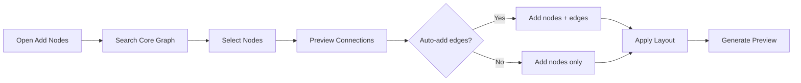
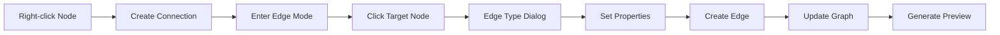
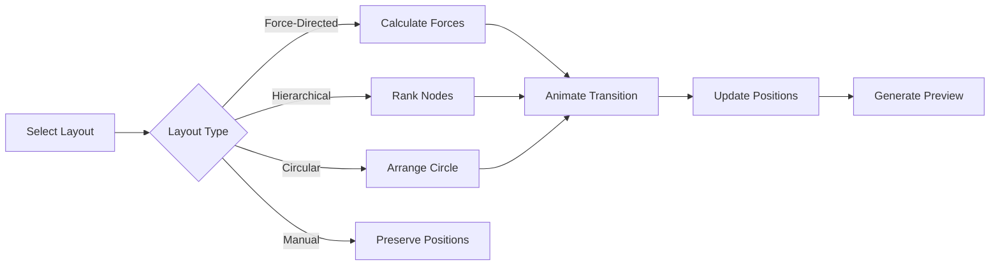

# Spec 11: Graph Scene Planning Stub

**Initiative**: Authoring-Viewing Unification  
**Date**: October 14, 2025  
**Status**: Planning Stub - Requires Design Workshop  
**Type**: Scene Type Planning Document  
**Depends On**: [Spec 04](./04-authoring-overlay.md), [Spec 05](./05-context-menu.md)

---

## Overview

This is a **planning stub** for the Graph scene type. Graph authoring is significantly more complex than Card or Document scenes and requires a dedicated design workshop before full specification. This document captures user stories, UX challenges, and open questions.

**Purpose**: Identify complexity, risks, and design questions for Graph scene authoring.

---

## Integration with Existing Graph Studio

### Current State

Protogen already has a Graph Studio (`shared/src/systems/graph-studio/`):

**Existing Capabilities**:
- Sigma.js-based graph visualization
- Node/edge rendering with Core Graph data
- Subgraph system for logical node groupings
- Drag-and-drop node positioning
- Context menus (right-click)
- Node position persistence

**Existing Challenges** (from Consolidated TODO Plan):
- 29 TypeScript errors in authoring components
- Awaiting authoring system redesign

**Integration Approach**:
- Extend Graph Studio with unified authoring overlay
- Apply consistent selection/highlighting from Spec 06
- Integrate context menus from Spec 05
- Use preview service from Spec 07

---

## User Stories

### As a Content Author

1. **Node Management**
   - I want to add nodes from the Core Graph to my scene
   - I want to position nodes visually (drag-and-drop)
   - I want to edit node properties (label, color, size)
   - I want to remove nodes from the scene (not from Core Graph)

2. **Edge Management**
   - I want edges to auto-import when I add connected nodes
   - I want to hide/show specific edges for presentation clarity
   - I want to create new edges between existing nodes
   - I want to style edges (color, width, label)

3. **Layout & Organization**
   - I want to apply automatic layouts (force-directed, hierarchical, circular)
   - I want to manually adjust layouts for better storytelling
   - I want to group related nodes visually
   - I want to save my layout as a preset

4. **Navigation**
   - I want to zoom in on specific nodes/clusters
   - I want to use a mini-map for orientation
   - I want to filter nodes by type or metadata
   - I want to search for specific nodes

5. **Presentation**
   - I want to create "views" within a scene (different zoom/focus/filter)
   - I want to animate transitions between views
   - I want to highlight specific paths through the graph
   - I want to annotate nodes with callouts (future: engagement system)

---

## UX Challenges

### Challenge 1: Selection in Dense Graphs

**Problem**: Clicking in dense graphs may select wrong node

**Options**:
- **A**: Magnifying glass on hover (zoom preview)
- **B**: Selection precision mode (slows down, increases target size)
- **C**: Breadcrumb selection (click narrows down candidates)
- **D**: Lasso selection for multi-select

**Recommendation**: Combination of A + D for best UX

### Challenge 2: Edge Selection

**Problem**: Edges are thin targets, hard to click

**Options**:
- **A**: Invisible wide hit target around edge
- **B**: Click endpoints to select edge
- **C**: Edge must be isolated (zoom in first)
- **D**: Select from edge list in property panel

**Recommendation**: A (wide hit target) + D (list fallback)

### Challenge 3: Mini-Map vs Zoom

**Problem**: How to navigate large graphs?

**Options**:
- **A**: Mini-map in corner showing full graph + viewport
- **B**: Zoom controls only (scroll-based)
- **C**: Overview + Detail pattern (separate views)
- **D**: Breadcrumb trail showing zoom path

**Recommendation**: A (mini-map) + D (breadcrumbs) for best orientation

### Challenge 4: Authoring Affordances

**Problem**: What editing controls to show for graphs?

**Options**:
- **A**: Floating toolbar near selected node
- **B**: Property panel in right drawer (consistent with other types)
- **C**: Context menu only (minimal UI)
- **D**: Inline controls on node hover

**Recommendation**: B (property panel) + C (context menu) for consistency

### Challenge 5: Preview Generation

**Problem**: How to generate meaningful graph previews?

**Options**:
- **A**: Full graph at small scale (may be unreadable)
- **B**: Center region only (loses context)
- **C**: Key nodes + summary structure
- **D**: Minimap-style visualization

**Recommendation**: D (minimap style) with smart node sampling

---

## Proposed Node Selection Concepts

### Selection States

```typescript
interface GraphSelectionState {
  // Single node selection
  selectedNode?: {
    nodeId: string;
    highlight: 'glow' | 'ring' | 'overlay';
  };
  
  // Multiple node selection
  selectedNodes?: string[];
  
  // Edge selection
  selectedEdge?: {
    edgeId: string;
    source: string;
    target: string;
  };
  
  // Path selection (series of connected nodes)
  selectedPath?: {
    nodeIds: string[];
    edgeIds: string[];
  };
  
  // Region selection (lasso)
  selectedRegion?: {
    bounds: { x: number; y: number; width: number; height: number };
    nodeIds: string[];
  };
}
```

### Visual Feedback Options

**Option A: Glow Effect**
```typescript
interface GlowHighlight {
  type: 'glow';
  color: string;              // Selection color
  size: number;               // Glow radius (4-12px)
  pulseAnimation: boolean;    // Subtle pulse
  intensity: number;          // 0-1 opacity
}

// Pros: Non-intrusive, works on any background
// Cons: May be subtle, performance with many selected
```

**Option B: Ring Around Node**
```typescript
interface RingHighlight {
  type: 'ring';
  color: string;
  width: number;              // Ring thickness (2-4px)
  offset: number;             // Distance from node (2-8px)
  dashed: boolean;            // Dashed for secondary selection
}

// Pros: Clear indication, precise
// Cons: May obscure nearby nodes in dense graphs
```

**Option C: Color Overlay**
```typescript
interface OverlayHighlight {
  type: 'overlay';
  color: string;
  opacity: number;            // 0.2-0.4 typical
  preserveLabel: boolean;
  dimOthers: boolean;         // Dim non-selected nodes
}

// Pros: Dramatic effect, good for presentations
// Cons: Changes node appearance significantly
```

**Recommendation**: Ring (Option B) for authoring, Overlay (Option C) for presentations

---

## Authoring Workflows (Conceptual)

### Add Nodes from Core Graph



### Create New Edge



### Apply Layout



---

## Integration Points

### With Existing Systems

**Subgraph System** (existing):
- Graph scenes reference subgraphs
- Authoring modifies subgraph membership
- Subgraph changes reflected in scene

**Central Graph** (existing):
- Core Graph is canonical data
- Scene Graph is presentational view
- No edits to Core Graph from scene authoring

**Navigator**:
- Node-level navigation (focus on node)
- Path navigation (follow edge sequences)
- Cluster navigation (zoom to node groups)

**Preview Service**:
- Generate minimap-style previews
- Smart node sampling for readability
- Multiple preview variants (full, region, key nodes)

---

## Open Questions for Design Workshop

### Question 1: Node Addition UX

**Options**:
- A) Search dialog with Core Graph browse
- B) Drag from sidebar node palette
- C) Import from subgraph templates
- D) Duplicate from existing scene

**Decision Needed**: Which provides best UX for different use cases?

### Question 2: Edge Visibility Management

**Options**:
- A) Show all edges by default, hide individually
- B) Hide all edges by default, show individually
- C) Smart filtering (show only primary relationships)
- D) Layer-based visibility (like Photoshop layers)

**Decision Needed**: How to balance information density with clarity?

### Question 3: Layout Algorithms

**Options**:
- A) Force-directed only (simple, automatic)
- B) Multiple layouts (hierarchical, circular, grid, radial)
- C) Manual positioning only (full control)
- D) Hybrid (auto-layout then manual tweaks)

**Decision Needed**: Which algorithms to implement first? Priority order?

### Question 4: Multi-Scene Graph Coordination

**Scenario**: Multiple scenes reference same subgraph

**Options**:
- A) Each scene has independent layout
- B) Shared layout across scenes (with scene overrides)
- C) Layout templates that scenes can apply
- D) Live sync of layout changes

**Decision Needed**: How to handle layout coordination?

### Question 5: Preview Generation Strategy

**Options**:
- A) Full graph scaled down (may be unreadable)
- B) Intelligent node sampling (show key nodes only)
- C) Center region with fade edges
- D) Multiple preview types (user selects)

**Decision Needed**: Which provides most useful at-a-glance recognition?

### Question 6: Performance with Large Graphs

**Scenario**: 1000+ nodes in subgraph

**Options**:
- A) Virtualization (render only visible nodes)
- B) Level-of-detail (simplify distant nodes)
- C) Clustering (group distant nodes)
- D) Pagination/filtering (show subset)

**Decision Needed**: What combination ensures smooth performance?

---

## Phased Implementation Plan

### Phase 3.1: Foundation (Week 1-2)

**Goals**:
- Integrate Graph Studio with unified authoring overlay
- Apply consistent selection/highlighting
- Basic node positioning

**Deliverables**:
- Graph scene rendering with authoring overlay
- Node selection with consistent highlighting
- Drag-and-drop positioning (already exists, integrate)

### Phase 3.2: Node Management (Week 3-4)

**Goals**:
- Add nodes from Core Graph
- Remove nodes from scene
- Edit node properties

**Deliverables**:
- Node search and addition UI
- Property inspector for nodes
- Context menus for node actions

### Phase 3.3: Edge Management (Week 5-6)

**Goals**:
- Auto-import connected edges
- Hide/show edge management
- Create new edges

**Deliverables**:
- Edge visibility controls
- Edge creation mode
- Edge property inspector

### Phase 3.4: Layouts (Week 7-8)

**Goals**:
- Implement layout algorithms
- Layout presets
- Manual positioning

**Deliverables**:
- Force-directed layout
- Layout selector UI
- Save layout as preset

### Phase 3.5: Preview & Polish (Week 9-10)

**Goals**:
- Graph preview generation
- Mini-map
- Performance optimization

**Deliverables**:
- Minimap-style previews
- Mini-map navigation component
- Virtualization for large graphs

---

## Success Criteria (for Future Spec)

When Graph scene type is fully specified:

### Functional
- [ ] Add/remove nodes from scene
- [ ] Position nodes (drag-and-drop)
- [ ] Edit node properties
- [ ] Manage edge visibility
- [ ] Create new edges
- [ ] Apply layout algorithms
- [ ] Navigate large graphs (zoom, mini-map)

### UX
- [ ] Selection feels precise in dense graphs
- [ ] Edge selection is reliable
- [ ] Layout changes are smooth (animated)
- [ ] Preview is recognizable

### Performance
- [ ] 1000+ node graphs render smoothly
- [ ] Preview generation < 1s for large graphs
- [ ] Layout calculation < 2s

### Integration
- [ ] Works with existing Graph Studio
- [ ] Uses Core Graph and Subgraph system
- [ ] Follows authoring overlay patterns
- [ ] Consistent with Card/Document UX

---

## Dependencies

### Technical Dependencies

- **Sigma.js** (existing): Graph visualization library
- **Force-directed algorithm**: For automatic layouts
- **Quadtree/Spatial index**: For efficient hit testing in dense graphs
- **Web Workers**: For layout calculation off main thread

### System Dependencies

- Core Graph and Subgraph models (existing)
- Preview Service (Spec 07)
- Authoring Overlay (Spec 04)
- Navigator enhancements (Spec 03)
- Context Menu system (Spec 05)

---

## Recommendations for Design Workshop

### Workshop Goals

1. Review user stories and validate priorities
2. Decide on selection/highlighting approach (glow vs ring vs overlay)
3. Choose initial layout algorithms
4. Define edge visibility strategy
5. Specify preview generation approach
6. Address performance for large graphs

### Workshop Participants

- UX Designer (graph interaction expertise)
- Frontend Developer (Sigma.js experience)
- Product Owner (feature prioritization)
- End Users (feedback on existing Graph Studio)

### Workshop Outputs

- Detailed UX flows for all authoring operations
- Visual design mockups
- Technical feasibility assessment
- Revised timeline for implementation
- Full specification document (Spec 11 v2)

---

## Placeholder Interfaces

### Graph Scene Model (Conceptual)

```typescript
// Conceptual - TBD in workshop
interface GraphScene extends Scene {
  scene_type: 'graph';
  config: GraphSceneConfig;
  subgraphId: string;            // Reference to subgraph
  layout?: SavedLayout;
  views?: GraphView[];           // Saved zoom/filter states
}

interface GraphSceneConfig {
  defaultLayout: LayoutType;
  edgeVisibility: 'all' | 'filtered' | 'on-hover';
  nodeSizeMode: 'uniform' | 'by-degree' | 'by-metadata';
  labelVisibility: 'always' | 'on-zoom' | 'on-hover';
  miniMapEnabled: boolean;
}

type LayoutType = 'force-directed' | 'hierarchical' | 'circular' | 'grid' | 'radial' | 'manual';

interface SavedLayout {
  id: string;
  name: string;
  positions: Map<string, { x: number; y: number }>;
  zoom: number;
  center: { x: number; y: number };
}

interface GraphView {
  id: string;
  name: string;
  zoom: number;
  center: { x: number; y: number };
  filter?: NodeFilter;
  highlightedPaths?: string[][];  // Sequences of node IDs
}
```

---

## Testing Considerations

### Test Scenarios (TBD)

```typescript
// Placeholder test structure
describe('Graph Scene Authoring', () => {
  describe('Node Management', () => {
    it.todo('should add nodes from Core Graph');
    it.todo('should remove nodes from scene');
    it.todo('should edit node properties');
    it.todo('should position nodes via drag-and-drop');
  });
  
  describe('Edge Management', () => {
    it.todo('should auto-import edges when adding connected nodes');
    it.todo('should hide/show edges');
    it.todo('should create new edges');
    it.todo('should edit edge properties');
  });
  
  describe('Layouts', () => {
    it.todo('should apply force-directed layout');
    it.todo('should save custom layout');
    it.todo('should animate layout transitions');
  });
  
  describe('Performance', () => {
    it.todo('should handle 1000+ nodes smoothly');
    it.todo('should virtualize rendering');
    it.todo('should generate preview < 1s');
  });
});
```

---

## Risk Assessment

### High Risk

**Complexity**: Graph authoring is inherently complex
- Mitigation: Phased approach, start with basics
- Validation: User testing at each phase

**Performance**: Large graphs may be slow
- Mitigation: Virtualization, Web Workers, LOD
- Validation: Performance benchmarks

### Medium Risk

**UX Confusion**: Different from Card/Document
- Mitigation: Consistent patterns where possible
- Validation: User testing, tutorials

**Edge Cases**: Dense graphs, overlapping nodes
- Mitigation: Precision mode, alternative selection methods
- Validation: Test with real-world complex graphs

### Low Risk

**Integration**: Should integrate smoothly with existing systems
- Mitigation: Follow established patterns
- Validation: Integration tests

---

## Acceptance Criteria (for Final Spec)

When Graph scene specification is complete (post-workshop):

**Planning**:
- [ ] All UX questions answered
- [ ] Selection/highlighting approach chosen
- [ ] Layout algorithms prioritized
- [ ] Edge visibility strategy defined
- [ ] Preview generation approach specified

**Documentation**:
- [ ] Full data models documented
- [ ] Component interfaces defined
- [ ] Workflow diagrams created
- [ ] Testing strategy established

**Validation**:
- [ ] Design reviewed by stakeholders
- [ ] Technical feasibility confirmed
- [ ] Performance targets established
- [ ] Integration points verified

---

## Next Steps

1. **Schedule Design Workshop** (2-hour session)
2. **Review Existing Graph Studio** (understand current capabilities)
3. **Gather User Feedback** (on existing graph features)
4. **Create Detailed Spec** (post-workshop)
5. **Begin Phase 3.1** (foundation implementation)

---

## Status

**Current**: Planning stub only  
**Next**: Design workshop to answer open questions  
**Timeline**: 2 weeks from workshop to full specification  
**Implementation**: 8-10 weeks (phased approach)

---

## References

- **Previous**: [Spec 10: Document Scene Type](./10-document-scene-type.md)
- **Next**: [Spec 12: Video Scene Deferred Stub](./12-video-deferred-stub.md)
- **Related**:
  - Existing Graph Studio in `shared/src/systems/graph-studio/`
  - Central Graph Roadmap in `docs/active-development/CENTRAL_GRAPH_ROADMAP.md`
  - Subgraph system documentation

---

## Changelog

**2025-10-14**: Initial planning stub created  
**Status**: Awaiting design workshop

