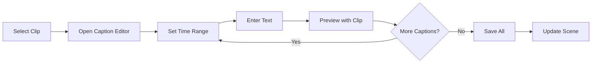

# Spec 12: Video Scene Deferred Stub

**Initiative**: Authoring-Viewing Unification  
**Date**: October 14, 2025  
**Status**: Deferred - Planning Stub Only  
**Type**: Scene Type Planning Document  
**Depends On**: Card and Document scene types proven successful

---

## Overview

This is a **deferred planning stub** for the Video scene type. Video authoring introduces timeline complexity similar to Graph scenes and is deferred until Card, Document, and Graph scene types are successfully implemented.

**Purpose**: Document complexity drivers, dependencies, and success criteria for future planning.

---

## Complexity Drivers

### 1. Timeline Editing Complexity

**Challenge**: Video editing requires timeline UI with precision controls

**Complexity Factors**:
- Frame-accurate trimming (start/end points)
- Multiple clips in sequence
- Transition effects between clips
- Synchronization of captions/overlays
- Playback preview during editing
- Waveform visualization for audio

**Comparison**: Similar complexity to Graph scene type (8-10 week effort)

### 2. Media Management

**Challenge**: Large video files require special handling

**Complexity Factors**:
- Upload and processing of video files
- Transcoding for web playback (multiple formats/resolutions)
- Thumbnail/poster frame extraction
- Storage management (CDN integration)
- Progress indicators for uploads
- Error handling for corrupt/unsupported files

### 3. Playback Synchronization

**Challenge**: Multiple media elements need coordination

**Complexity Factors**:
- Video player state management
- Caption synchronization with video timeline
- Audio track management
- Playback controls (play, pause, seek, speed)
- Autoplay policies (browser restrictions)
- Fullscreen mode

---

## Conceptual Data Model

### Video Scene (Placeholder)

```typescript
// Conceptual - subject to change
interface VideoScene extends Scene {
  scene_type: 'video';
  config: VideoSceneConfig;
  clips: VideoClip[];
  captions?: Caption[];
}

interface VideoSceneConfig {
  autoPlay: boolean;
  loop: boolean;
  controls: 'visible' | 'hover' | 'hidden';
  defaultVolume: number;         // 0-100
  allowFullscreen: boolean;
  aspectRatio: '16:9' | '4:3' | '1:1' | 'auto';
}

interface VideoClip {
  id: string;
  order: number;
  assetId: string;               // Video file asset
  
  // Trimming
  startTime: number;             // Seconds
  endTime: number;               // Seconds
  duration?: number;             // Calculated
  
  // Transitions
  transitionIn?: VideoTransition;
  transitionOut?: VideoTransition;
  
  // Metadata
  title?: string;
  description?: string;
  posterFrame?: number;          // Timestamp for poster (seconds)
}

interface VideoTransition {
  type: 'none' | 'fade' | 'dissolve' | 'wipe';
  duration: number;              // Seconds
}

interface Caption {
  id: string;
  clipId: string;
  startTime: number;
  endTime: number;
  text: string;
  position: 'top' | 'center' | 'bottom';
  language?: string;
}
```

---

## Authoring Workflows (Conceptual)

### Add Video Clip Flow


### Timeline Editing Flow


### Add Captions Flow



---

## UI Components (Conceptual)

### Timeline Editor

```typescript
// Conceptual interface - TBD
interface TimelineEditor {
  // Clip track
  clips: VideoClip[];
  
  // Playhead
  currentTime: number;
  
  // Zoom level
  pixelsPerSecond: number;       // Timeline zoom
  
  // Selection
  selectedClip?: VideoClip;
  
  // Trim handles
  trimMode: boolean;
  
  // Preview
  previewEnabled: boolean;
}
```

### Caption Editor

```typescript
// Conceptual interface - TBD
interface CaptionEditor {
  clip: VideoClip;
  captions: Caption[];
  currentTime: number;
  
  // Actions
  addCaption(startTime: number, endTime: number, text: string): void;
  editCaption(id: string, updates: Partial<Caption>): void;
  removeCaption(id: string): void;
  
  // Preview
  playWithCaptions(): void;
}
```

---

## Dependencies

### External Libraries

**Video.js** or **Plyr.js**: Video player with good API  
**FFmpeg.js** (optional): Client-side video processing  
**Waveform.js**: Audio waveform visualization  

### Protogen Systems

- **Asset Management**: Video file storage and serving
- **Preview Service**: Poster frame generation (extends Spec 07)
- **Authoring Overlay**: Timeline selection and trimming (extends Spec 04)
- **Navigator**: Clip-level navigation within scenes (extends Spec 03)

### Infrastructure

- **CDN**: Video file delivery
- **Transcoding Service**: Convert videos to web formats (H.264, WebM)
- **Storage**: Large file handling (S3 or similar)
- **Streaming**: HLS or DASH for adaptive bitrate

---

## Success Criteria (Future)

When Video scene type is implemented:

### Functional
- [ ] Upload and transcode videos
- [ ] Trim clips (start/end points)
- [ ] Sequence multiple clips
- [ ] Add transitions between clips
- [ ] Synchronize captions with playback
- [ ] Generate poster frames
- [ ] Preview scene with all clips

### UX
- [ ] Timeline editing feels natural
- [ ] Frame-accurate trimming
- [ ] Smooth playback in preview
- [ ] Responsive video player

### Performance
- [ ] Fast upload (with progress)
- [ ] Quick transcoding (or background)
- [ ] Smooth timeline scrubbing
- [ ] Efficient caption rendering

### Integration
- [ ] Works with existing authoring patterns
- [ ] Uses Preview Service for posters
- [ ] Integrates with Navigator
- [ ] Consistent UX with other scene types

---

## Estimated Effort

**Planning**: 2-3 weeks
- Requirements gathering
- UX design and mockups
- Technical spike (video processing)
- Full specification document

**Implementation**: 8-12 weeks
- Video upload and processing (2 weeks)
- Timeline editor UI (3-4 weeks)
- Clip editing and transitions (2-3 weeks)
- Caption system (1-2 weeks)
- Preview generation (1 week)
- Testing and polish (1-2 weeks)

**Total**: 10-15 weeks from start to completion

---

## Risks

### High Risk

**Video Processing Complexity**:
- Transcoding takes time and resources
- Multiple format/resolution variants needed
- Error handling for corrupt files

**Storage Costs**:
- Video files are large (GB vs MB for images)
- Requires significant storage infrastructure
- CDN costs for video delivery

### Medium Risk

**Browser Compatibility**:
- Video format support varies by browser
- Autoplay policies differ
- Fullscreen API inconsistencies

**Performance**:
- Timeline scrubbing must be smooth
- Large timelines may be slow
- Preview generation intensive

### Low Risk

**UI Complexity**:
- Timeline editors are well-understood patterns
- Existing libraries available
- Similar to audio editing tools

---

## Deferral Rationale

**Why Deferred**:

1. **Complexity**: Video is as complex as Graph, requires dedicated effort
2. **Dependencies**: Need proven Card/Document patterns first
3. **Infrastructure**: Requires video processing infrastructure not yet in place
4. **Priority**: Card, Document, Graph are higher priority for users
5. **Resource**: Large time investment better spent on higher priority features

**When to Revisit**:

- After Card, Document, and Graph scene types successful
- When video infrastructure ready (transcoding, CDN)
- When user demand justifies investment
- Estimated: M4 milestone (4-6 months from M1)

---

## Placeholder Context Actions

```typescript
// Placeholder actions for Video scene (TBD)
const videoSceneActions = {
  clip: [
    {
      id: 'trim-clip',
      label: 'Trim Clip...',
      icon: 'scissors',
      handler: () => {
        // TBD: Open timeline editor
      }
    },
    {
      id: 'add-caption',
      label: 'Add Caption...',
      icon: 'closed-caption',
      handler: () => {
        // TBD: Open caption editor
      }
    },
    {
      id: 'set-poster',
      label: 'Set Poster Frame',
      icon: 'image',
      handler: () => {
        // TBD: Poster frame picker
      }
    },
    {
      id: 'remove-clip',
      label: 'Remove Clip',
      icon: 'trash',
      variant: 'danger',
      handler: async () => {
        // TBD: Confirmation and removal
      }
    }
  ],
  
  blank: [
    {
      id: 'add-video-clip',
      label: 'Add Video Clip',
      icon: 'video',
      handler: async () => {
        // TBD: File picker and upload
      }
    }
  ]
};

// Note: Will be fully defined when Video scene type is prioritized
```

---

## Acceptance Criteria (for This Stub)

- [x] Video scene complexity drivers identified
- [x] Conceptual data model outlined
- [x] Authoring workflows conceptualized
- [x] Dependencies documented (libraries, systems, infrastructure)
- [x] Success criteria for future implementation
- [x] Effort estimates provided
- [x] Risks assessed
- [x] Deferral rationale documented
- [x] Placeholder interfaces provided
- [x] Timeline for revisiting established

**Status**: ✅ Complete (as planning stub) - Phase 4 Complete!

---

## References

- **Previous**: [Spec 11: Graph Scene Planning Stub](./11-graph-planning-stub.md)
- **Next**: [Spec 13: Orchestrator Integration](./13-orchestrator-integration.md)
- **Related**: Video scene mentioned in original vision document

---

## Changelog

**2025-10-14**: Deferred planning stub created  
**Status**: Documented for future consideration

