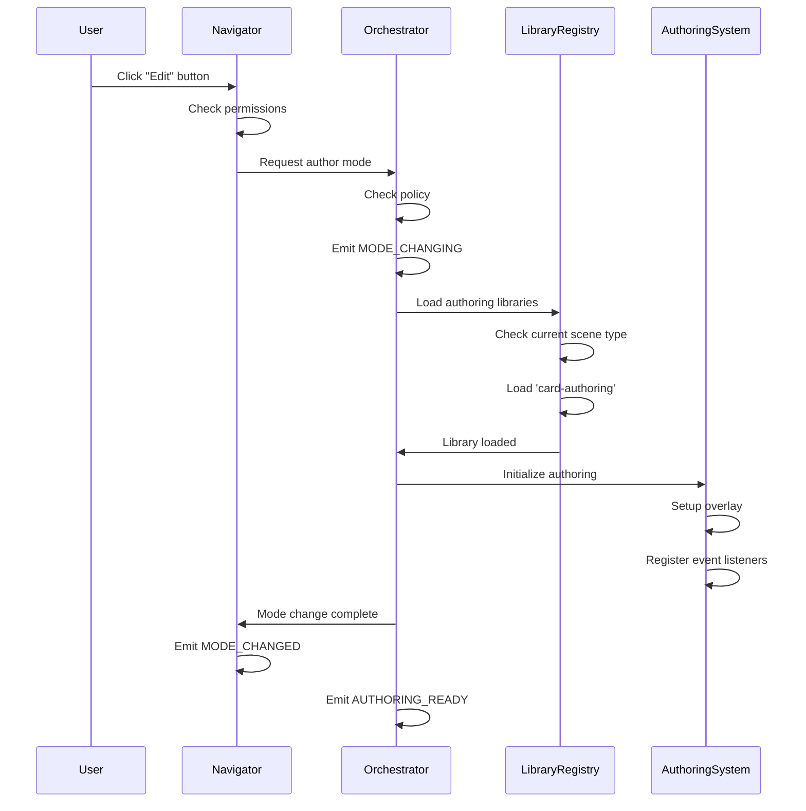
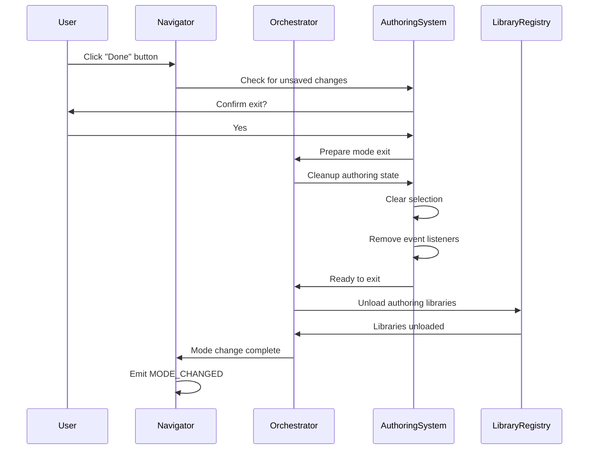

# Spec 13: Orchestrator Integration

**Initiative**: Authoring-Viewing Unification  
**Date**: October 14, 2025  
**Status**: Planning Phase  
**Type**: System Integration Specification  
**Depends On**: [Spec 01](./01-module-integration.md), [Spec 02](./02-event-taxonomy.md), [Spec 04](./04-authoring-overlay.md)

---

## Overview

This specification defines how authoring capabilities integrate with Protogen's **existing Orchestrator system** for dynamic subsystem loading, lazy library loading, and policy enforcement. This is **NOT a new "OrchestratorBridge" system** but enhancements to the existing Orchestrator.

**Principle**: Load authoring libraries only when needed; unload when mode exits.

---

## Existing Orchestrator System

### Current Orchestrator Architecture

Per `docs/active-development/ORCHESTRATOR_SYSTEM_ARCHITECTURE.md`:

```typescript
// Existing Orchestrator (simplified view)
class OrchestratorSystem {
  private systems = new Map<string, SystemInstance>();
  
  // Existing methods
  registerSystem(name: string, system: SystemInstance): void;
  getSystem<T>(name: string): T;
  emit(event: string, payload: any): void;
  
  // Event coordination
  on(event: string, handler: EventHandler): void;
  off(event: string, handler: EventHandler): void;
}
```

**Current Responsibilities**:
- System registration and lifecycle
- Event distribution between systems
- State coordination
- Service location

---

## Enhancements for Authoring

### Extended Orchestrator Interface

```typescript
class OrchestratorSystem {
  // ✨ EXISTING methods (unchanged)
  registerSystem(name: string, system: SystemInstance): void;
  getSystem<T>(name: string): T;
  emit(event: string, payload: any): void;
  on(event: string, handler: EventHandler): void;
  off(event: string, handler: EventHandler): void;
  
  // ✨ NEW: Dynamic library loading
  async loadLibrary(libraryId: string): Promise<void>;
  async unloadLibrary(libraryId: string): Promise<void>;
  isLibraryLoaded(libraryId: string): boolean;
  getLoadedLibraries(): string[];
  
  // ✨ NEW: Scene-type library management
  async ensureSceneTypeLibrary(sceneType: SceneType, mode: 'view' | 'author'): Promise<void>;
  async loadAuthoringLibrary(sceneType: SceneType): Promise<void>;
  async unloadAuthoringLibrary(sceneType: SceneType): Promise<void>;
  
  // ✨ NEW: Policy enforcement
  canLoadAuthoring(): boolean;
  enforcePolicy(policy: OrchestratorPolicy): void;
  getActivePolicy(): OrchestratorPolicy;
  
  // ✨ NEW: State persistence
  async persistState(key: string, state: any): Promise<void>;
  async restoreState(key: string): Promise<any>;
  clearState(key: string): void;
}
```

---

## Library Loading

### Library Registry

```typescript
interface LibraryDefinition {
  id: string;
  type: 'viewing' | 'authoring';
  sceneType?: SceneType;         // Scene-specific or global
  loader: () => Promise<any>;    // Dynamic import function
  dependencies?: string[];       // Other libraries required first
  size: number;                  // Estimated bundle size (KB)
}

class LibraryRegistry {
  private libraries = new Map<string, LibraryDefinition>();
  private loaded = new Map<string, any>();
  
  register(definition: LibraryDefinition): void {
    this.libraries.set(definition.id, definition);
  }
  
  async load(libraryId: string): Promise<any> {
    // Check if already loaded
    if (this.loaded.has(libraryId)) {
      return this.loaded.get(libraryId);
    }
    
    const definition = this.libraries.get(libraryId);
    if (!definition) {
      throw new Error(`Library not found: ${libraryId}`);
    }
    
    // Load dependencies first
    if (definition.dependencies) {
      await Promise.all(
        definition.dependencies.map(dep => this.load(dep))
      );
    }
    
    // Emit loading event
    orchestratorSystem.emit('LIBRARY_LOADING', {
      libraryId,
      type: definition.type,
      size: definition.size
    });
    
    // Load library (dynamic import)
    const library = await definition.loader();
    
    // Cache loaded library
    this.loaded.set(libraryId, library);
    
    // Emit loaded event
    orchestratorSystem.emit('LIBRARY_LOADED', {
      libraryId,
      type: definition.type
    });
    
    return library;
  }
  
  unload(libraryId: string): void {
    this.loaded.delete(libraryId);
    
    orchestratorSystem.emit('LIBRARY_UNLOADED', {
      libraryId
    });
  }
}
```

### Library Definitions

```typescript
// Register scene-type libraries
const libraryDefinitions: LibraryDefinition[] = [
  // Card scene - viewing
  {
    id: 'card-viewing',
    type: 'viewing',
    sceneType: 'card',
    loader: () => import('@protogen/shared/systems/scene/renderers/CardRenderer'),
    size: 15  // KB
  },
  
  // Card scene - authoring
  {
    id: 'card-authoring',
    type: 'authoring',
    sceneType: 'card',
    loader: () => import('@protogen/shared/systems/authoring/scene-types/card'),
    dependencies: ['card-viewing'],  // Requires viewer
    size: 30  // KB
  },
  
  // Document scene - viewing
  {
    id: 'document-viewing',
    type: 'viewing',
    sceneType: 'document',
    loader: () => import('@protogen/shared/systems/scene/renderers/DocumentRenderer'),
    dependencies: ['tiptap-core'],  // Rich text editor
    size: 45  // KB
  },
  
  // Document scene - authoring
  {
    id: 'document-authoring',
    type: 'authoring',
    sceneType: 'document',
    loader: () => import('@protogen/shared/systems/authoring/scene-types/document'),
    dependencies: ['document-viewing', 'tiptap-extensions'],
    size: 60  // KB
  },
  
  // Graph scene - viewing (already loaded - existing Graph Studio)
  {
    id: 'graph-viewing',
    type: 'viewing',
    sceneType: 'graph',
    loader: () => import('@protogen/shared/systems/graph-studio'),
    size: 80  // KB
  },
  
  // Graph scene - authoring (future)
  {
    id: 'graph-authoring',
    type: 'authoring',
    sceneType: 'graph',
    loader: () => import('@protogen/shared/systems/authoring/scene-types/graph'),
    dependencies: ['graph-viewing'],
    size: 50  // KB (TBD)
  }
];

// Register all libraries
libraryDefinitions.forEach(def => {
  libraryRegistry.register(def);
});
```

---

## Scene-Type Library Loading

### Ensure Library Method

```typescript
class OrchestratorSystem {
  async ensureSceneTypeLibrary(
    sceneType: SceneType,
    mode: 'view' | 'author'
  ): Promise<void> {
    // Viewing library always needed
    const viewingLibId = `${sceneType}-viewing`;
    await libraryRegistry.load(viewingLibId);
    
    // Authoring library only in author mode
    if (mode === 'author') {
      const authoringLibId = `${sceneType}-authoring`;
      
      // Check policy
      if (!this.canLoadAuthoring()) {
        throw new Error('Cannot load authoring libraries in view mode');
      }
      
      await libraryRegistry.load(authoringLibId);
    }
  }
  
  async loadAuthoringLibrary(sceneType: SceneType): Promise<void> {
    if (!this.canLoadAuthoring()) {
      throw new Error('Authoring libraries cannot be loaded in view mode');
    }
    
    const libraryId = `${sceneType}-authoring`;
    await libraryRegistry.load(libraryId);
    
    // Register with authoring system
    const library = libraryRegistry.getLoaded(libraryId);
    if (library.plugin) {
      authoringSystem.registerPlugin(library.plugin);
    }
  }
  
  async unloadAuthoringLibrary(sceneType: SceneType): Promise<void> {
    const libraryId = `${sceneType}-authoring`;
    
    // Unregister from authoring system
    authoringSystem.unregisterPlugin(sceneType);
    
    // Unload library
    libraryRegistry.unload(libraryId);
  }
}
```

---

## Policy System

### Orchestrator Policy

```typescript
interface OrchestratorPolicy {
  // Library loading policies
  loadAuthoringOnlyInAuthorMode: boolean;
  preloadSceneTypes?: SceneType[];          // Preload these eagerly
  lazyLoadThreshold: number;                // Delay before lazy load (ms)
  unloadOnModeExit: boolean;                // Unload when exiting author mode
  
  // Resource policies
  maxConcurrentLoads: number;               // Max parallel library loads
  maxTotalLibrarySize: number;              // Total KB limit
  
  // Caching policies
  cacheLoadedLibraries: boolean;            // Keep in memory
  cacheDuration: number;                    // Time before unload (ms)
}

const defaultPolicy: OrchestratorPolicy = {
  loadAuthoringOnlyInAuthorMode: true,
  preloadSceneTypes: undefined,             // No eager loading
  lazyLoadThreshold: 100,                   // 100ms delay
  unloadOnModeExit: true,                   // Unload to save memory
  maxConcurrentLoads: 3,
  maxTotalLibrarySize: 2048,                // 2MB total
  cacheLoadedLibraries: true,
  cacheDuration: 1000 * 60 * 5              // 5 minutes
};
```

### Policy Enforcement

```typescript
class OrchestratorSystem {
  private policy: OrchestratorPolicy = defaultPolicy;
  
  enforcePolicy(policy: OrchestratorPolicy): void {
    this.policy = policy;
  }
  
  canLoadAuthoring(): boolean {
    // Check policy
    if (this.policy.loadAuthoringOnlyInAuthorMode) {
      return navigatorSystem.getMode() === 'author';
    }
    return true;
  }
  
  private async loadWithPolicy(libraryId: string): Promise<void> {
    // Check total size limit
    const currentSize = this.getTotalLoadedSize();
    const libraryDef = libraryRegistry.getDefinition(libraryId);
    
    if (currentSize + libraryDef.size > this.policy.maxTotalLibrarySize) {
      // Unload least recently used library
      await this.unloadLRU();
    }
    
    // Load with concurrency limit
    await this.loadQueue.enqueue(libraryId, this.policy.maxConcurrentLoads);
  }
  
  private getTotalLoadedSize(): number {
    return Array.from(libraryRegistry.getLoaded().values())
      .reduce((total, def) => total + def.size, 0);
  }
}
```

---

## Event Emission Patterns

### Load/Unload Events

```typescript
// Events emitted during library lifecycle
interface LibraryLoadingPayload {
  libraryId: string;
  type: 'viewing' | 'authoring';
  size: number;
  estimated Time: number;        // Estimated load time (ms)
}

interface LibraryLoadedPayload {
  libraryId: string;
  type: 'viewing' | 'authoring';
  loadTime: number;              // Actual load time
}

interface LibraryUnloadedPayload {
  libraryId: string;
  reason: 'mode-exit' | 'policy' | 'manual';
}

interface LibraryErrorPayload {
  libraryId: string;
  error: Error;
  retryable: boolean;
}

// Orchestrator emits these events
orchestratorSystem.on('LIBRARY_LOADING', (payload: LibraryLoadingPayload) => {
  // Show loading indicator
  showToast({ message: `Loading ${payload.libraryId}...`, variant: 'info' });
});

orchestratorSystem.on('LIBRARY_LOADED', (payload: LibraryLoadedPayload) => {
  console.log(`Loaded ${payload.libraryId} in ${payload.loadTime}ms`);
});

orchestratorSystem.on('LIBRARY_ERROR', (payload: LibraryErrorPayload) => {
  showToast({
    message: `Failed to load library: ${payload.error.message}`,
    variant: 'error'
  });
});
```

---

## Integration Sequence

### Enter Author Mode Sequence



### Exit Author Mode Sequence



---

## Scene Type Loading Strategy

### On-Demand Loading

```typescript
class SceneTypeLoader {
  private loadingPromises = new Map<string, Promise<void>>();
  
  async loadForScene(sceneId: string): Promise<void> {
    const scene = await sceneService.getScene(sceneId);
    const mode = navigatorSystem.getMode();
    
    const key = `${scene.scene_type}-${mode}`;
    
    // Check if already loading
    if (this.loadingPromises.has(key)) {
      return this.loadingPromises.get(key);
    }
    
    // Start loading
    const promise = orchestratorSystem.ensureSceneTypeLibrary(
      scene.scene_type,
      mode
    );
    
    this.loadingPromises.set(key, promise);
    
    try {
      await promise;
    } finally {
      this.loadingPromises.delete(key);
    }
  }
  
  async preloadSceneTypes(sceneTypes: SceneType[]): Promise<void> {
    await Promise.all(
      sceneTypes.map(type =>
        orchestratorSystem.ensureSceneTypeLibrary(type, 'view')
      )
    );
  }
}
```

### Failure Handling

```typescript
class LibraryLoadErrorHandler {
  private retryAttempts = new Map<string, number>();
  private maxRetries = 3;
  
  async handleLoadError(libraryId: string, error: Error): Promise<void> {
    const attempts = this.retryAttempts.get(libraryId) || 0;
    
    if (attempts < this.maxRetries) {
      // Retry with exponential backoff
      const delay = Math.pow(2, attempts) * 1000;  // 1s, 2s, 4s
      
      orchestratorSystem.emit('LIBRARY_RETRYING', {
        libraryId,
        attempt: attempts + 1,
        maxRetries: this.maxRetries,
        delay
      });
      
      await new Promise(resolve => setTimeout(resolve, delay));
      
      this.retryAttempts.set(libraryId, attempts + 1);
      
      try {
        await libraryRegistry.load(libraryId);
        this.retryAttempts.delete(libraryId);
      } catch (retryError) {
        await this.handleLoadError(libraryId, retryError as Error);
      }
    } else {
      // Max retries exceeded - fall back
      this.retryAttempts.delete(libraryId);
      
      orchestratorSystem.emit('LIBRARY_ERROR', {
        libraryId,
        error,
        retryable: false
      });
      
      await this.fallbackStrategy(libraryId, error);
    }
  }
  
  private async fallbackStrategy(libraryId: string, error: Error): Promise<void> {
    // Fallback options
    if (libraryId.includes('authoring')) {
      // Fall back to view-only mode
      showToast({
        message: 'Authoring features unavailable. Switching to view mode.',
        variant: 'warning'
      });
      
      navigatorSystem.exitAuthorMode();
    } else {
      // Viewing library failed - show error scene
      showErrorScene({
        title: 'Failed to load scene',
        message: error.message,
        action: {
          label: 'Retry',
          onClick: () => libraryRegistry.load(libraryId)
        }
      });
    }
  }
}
```

---

## State Persistence

### Authoring State Persistence

```typescript
interface PersistedState {
  key: string;
  data: any;
  timestamp: number;
  expiresAt?: number;
}

class StatePersistence {
  private storage = new Map<string, PersistedState>();
  
  async persist(key: string, data: any, ttl?: number): Promise<void> {
    const state: PersistedState = {
      key,
      data,
      timestamp: Date.now(),
      expiresAt: ttl ? Date.now() + ttl : undefined
    };
    
    // Store in memory
    this.storage.set(key, state);
    
    // Optionally persist to localStorage
    if (this.shouldPersistToStorage(key)) {
      try {
        localStorage.setItem(
          `protogen:state:${key}`,
          JSON.stringify(state)
        );
      } catch (error) {
        console.warn('Failed to persist to localStorage:', error);
      }
    }
    
    orchestratorSystem.emit('STATE_PERSISTED', { key });
  }
  
  async restore(key: string): Promise<any> {
    // Try memory first
    let state = this.storage.get(key);
    
    // Fall back to localStorage
    if (!state) {
      const stored = localStorage.getItem(`protogen:state:${key}`);
      if (stored) {
        state = JSON.parse(stored);
        this.storage.set(key, state);
      }
    }
    
    // Check expiration
    if (state && state.expiresAt && Date.now() > state.expiresAt) {
      this.clear(key);
      return null;
    }
    
    return state?.data || null;
  }
  
  clear(key: string): void {
    this.storage.delete(key);
    localStorage.removeItem(`protogen:state:${key}`);
    
    orchestratorSystem.emit('STATE_CLEARED', { key });
  }
  
  private shouldPersistToStorage(key: string): boolean {
    // Persist authoring state, selection, etc.
    return key.startsWith('authoring:') || key.startsWith('selection:');
  }
}
```

**Usage**:
```typescript
// Save authoring state when exiting
async function exitAuthorMode() {
  // Persist unsaved work
  await orchestratorSystem.persistState('authoring:current-scene', {
    sceneId: currentSceneId,
    selection: selectionEngine.getSelection(),
    unsavedChanges: authoringSystem.getChanges(),
    timestamp: Date.now()
  }, 1000 * 60 * 60);  // 1 hour TTL
  
  // Continue with exit...
}

// Restore state when re-entering
async function enterAuthorMode() {
  // Restore previous work
  const previousState = await orchestratorSystem.restoreState('authoring:current-scene');
  
  if (previousState && previousState.sceneId === currentSceneId) {
    // Restore selection and unsaved changes
    if (previousState.selection) {
      selectionEngine.select(previousState.selection);
    }
    
    if (previousState.unsavedChanges) {
      authoringSystem.restoreChanges(previousState.unsavedChanges);
    }
  }
  
  // Continue with enter...
}
```

---

## Integration Events

### New Orchestrator Events

```typescript
// Events for library lifecycle
type OrchestratorEvent =
  | 'LIBRARY_LOADING'
  | 'LIBRARY_LOADED'
  | 'LIBRARY_UNLOADED'
  | 'LIBRARY_RETRYING'
  | 'LIBRARY_ERROR'
  | 'STATE_PERSISTED'
  | 'STATE_RESTORED'
  | 'STATE_CLEARED'
  | 'AUTHORING_READY'
  | 'MODE_CHANGING';

// Event payload types
type OrchestratorEventPayload =
  | LibraryLoadingPayload
  | LibraryLoadedPayload
  | LibraryUnloadedPayload
  | LibraryRetryingPayload
  | LibraryErrorPayload
  | StatePersistedPayload
  | StateRestoredPayload
  | StateClearedPayload
  | AuthoringReadyPayload
  | ModeChangingPayload;
```

---

## Testing Strategy

### Unit Tests

```typescript
describe('Orchestrator Library Loading', () => {
  it('should load library dynamically', async () => {
    await orchestratorSystem.loadLibrary('card-viewing');
    
    expect(libraryRegistry.isLoaded('card-viewing')).toBe(true);
  });
  
  it('should load dependencies first', async () => {
    const loadOrder: string[] = [];
    
    libraryRegistry.on('LIBRARY_LOADED', (payload) => {
      loadOrder.push(payload.libraryId);
    });
    
    await orchestratorSystem.loadLibrary('card-authoring');
    
    expect(loadOrder).toEqual(['card-viewing', 'card-authoring']);
  });
  
  it('should enforce policy for authoring libraries', async () => {
    navigatorSystem.setMode('view');
    
    await expect(
      orchestratorSystem.loadAuthoringLibrary('card')
    ).rejects.toThrow('Cannot load authoring libraries in view mode');
  });
  
  it('should unload on mode exit', async () => {
    await orchestratorSystem.loadAuthoringLibrary('card');
    expect(libraryRegistry.isLoaded('card-authoring')).toBe(true);
    
    navigatorSystem.exitAuthorMode();
    
    await waitFor(() => {
      expect(libraryRegistry.isLoaded('card-authoring')).toBe(false);
    });
  });
});

describe('State Persistence', () => {
  it('should persist and restore state', async () => {
    const state = { selection: 'slide-123', zoom: 100 };
    
    await orchestratorSystem.persistState('authoring:test', state);
    const restored = await orchestratorSystem.restoreState('authoring:test');
    
    expect(restored).toEqual(state);
  });
  
  it('should expire old state', async () => {
    await orchestratorSystem.persistState('authoring:temp', { data: 'test' }, 100);
    
    // Wait for expiration
    await new Promise(resolve => setTimeout(resolve, 150));
    
    const restored = await orchestratorSystem.restoreState('authoring:temp');
    expect(restored).toBeNull();
  });
});
```

### Integration Tests

```typescript
describe('Orchestrator Integration', () => {
  it('should complete full authoring mode cycle', async () => {
    const events: string[] = [];
    
    orchestratorSystem.on('MODE_CHANGING', () => events.push('MODE_CHANGING'));
    orchestratorSystem.on('LIBRARY_LOADING', () => events.push('LIBRARY_LOADING'));
    orchestratorSystem.on('LIBRARY_LOADED', () => events.push('LIBRARY_LOADED'));
    orchestratorSystem.on('AUTHORING_READY', () => events.push('AUTHORING_READY'));
    
    await navigatorSystem.enterAuthorMode();
    
    expect(events).toEqual([
      'MODE_CHANGING',
      'LIBRARY_LOADING',
      'LIBRARY_LOADED',
      'AUTHORING_READY'
    ]);
  });
});
```

---

## Acceptance Criteria

- [x] Orchestrator System extensions defined (NOT new system)
- [x] Library loading interface (loadLibrary, unloadLibrary, ensureSceneTypeLibrary)
- [x] LibraryRegistry with dynamic imports
- [x] Library definitions for all scene types
- [x] Scene-type loading strategy
- [x] Policy system for authoring mode
- [x] Policy enforcement (loadAuthoringOnlyInAuthorMode)
- [x] Event emission patterns for library lifecycle
- [x] Failure handling with retry logic
- [x] Fallback strategies
- [x] State persistence system
- [x] Integration sequences (enter/exit author mode)
- [x] Testing strategy with unit and integration tests

**Status**: ✅ Complete - Ready for Spec 14

---

## References

- **Previous**: [Spec 12: Video Scene Deferred Stub](./12-video-deferred-stub.md)
- **Next**: [Spec 14: Persistence Models & Migrations](./14-persistence-models.md)
- **Related**: Orchestrator system in `shared/src/systems/orchestrator/`

---

## Changelog

**2025-10-14**: Initial specification created  
**Clarification**: Extends existing Orchestrator, not new "OrchestratorBridge"  
**Status**: Ready for stakeholder review

