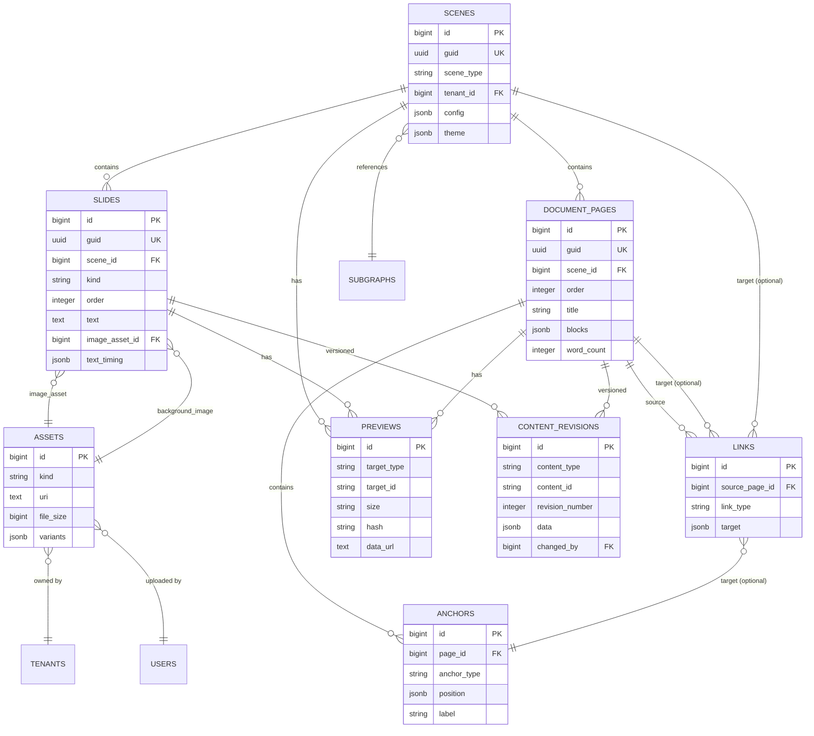

# Spec 14: Persistence Models & Migrations

**Initiative**: Authoring-Viewing Unification  
**Date**: October 14, 2025  
**Status**: Planning Phase  
**Type**: System Integration Specification  
**Depends On**: [Spec 09](./09-card-scene-type.md), [Spec 10](./10-document-scene-type.md), [Spec 11](./11-graph-planning-stub.md)

---

## Overview

This specification defines persistence models and database migrations for authoring features, extending Protogen's existing Scene/Deck architecture. All changes are **additive and non-breaking** to preserve existing data.

**Principle**: Extend existing models with new fields; add new tables only when necessary.

---

## Existing Schema Context

### Current Protogen Models

From `docs/core-foundation.md`:

```sql
-- Existing tables (preserved)
CREATE TABLE scenes (
    id BIGSERIAL PRIMARY KEY,
    guid UUID UNIQUE NOT NULL,
    name VARCHAR(255) NOT NULL,
    slug VARCHAR(255),
    scene_type VARCHAR(50),
    tenant_id BIGINT REFERENCES tenants(id),
    config JSONB,
    meta JSONB,
    theme JSONB,
    is_active BOOLEAN DEFAULT true,
    is_public BOOLEAN DEFAULT false,
    created_at TIMESTAMP DEFAULT NOW(),
    updated_at TIMESTAMP DEFAULT NOW()
);

CREATE TABLE decks (
    id BIGSERIAL PRIMARY KEY,
    name VARCHAR(255),
    slug VARCHAR(255),
    type VARCHAR(50),
    tenant_id BIGINT REFERENCES tenants(id),
    scene_ids JSONB,  -- Array of scene IDs
    navigation JSONB,
    performance JSONB,
    created_at TIMESTAMP DEFAULT NOW(),
    updated_at TIMESTAMP DEFAULT NOW()
);
```

---

## Extended Scene Model

### Scene Type Field Enhancement

```sql
-- Extend scene_type enum (via migration)
-- Existing types: 'system', 'custom', 'template'
-- New values: 'card', 'document', 'graph', 'video'

-- No schema change needed - scene_type is VARCHAR(50)
-- Just document valid values:

-- Scene Types:
-- 'card'     - Slide-based presentations
-- 'document' - Rich text documents
-- 'graph'    - Graph visualizations  
-- 'video'    - Video presentations
-- 'system'   - System scenes (existing)
-- 'custom'   - Custom scenes (existing)
```

### Scene Config for Scene Types

```typescript
// Extend config JSONB field with scene-type specific configs
type SceneConfig =
  | CardSceneConfig
  | DocumentSceneConfig
  | GraphSceneConfig
  | VideoSceneConfig;

// Config stored in scenes.config JSONB column
// No schema change - JSONB is flexible
```

---

## New Tables

### Slides Table (Card Scenes)

```sql
CREATE TABLE slides (
    id BIGSERIAL PRIMARY KEY,
    guid UUID UNIQUE NOT NULL DEFAULT gen_random_uuid(),
    scene_id BIGINT NOT NULL REFERENCES scenes(id) ON DELETE CASCADE,
    kind VARCHAR(20) NOT NULL,  -- 'text', 'image', 'layered'
    "order" INTEGER NOT NULL,
    
    -- Text slide fields
    text TEXT,
    font_size INTEGER,
    font_family VARCHAR(100),
    alignment VARCHAR(20),
    text_color VARCHAR(20),
    background_color VARCHAR(100),  -- Solid or gradient
    padding INTEGER,
    
    -- Image slide fields
    image_asset_id BIGINT REFERENCES assets(id),
    image_fit VARCHAR(20),  -- 'contain', 'cover', 'fill'
    image_position JSONB,   -- { x: %, y: % }
    caption JSONB,          -- Caption object
    
    -- Layered slide fields
    background_image_id BIGINT REFERENCES assets(id),
    background_fit VARCHAR(20),
    background_dim INTEGER,  -- 0-100 darkening
    text_position JSONB,     -- { vertical, horizontal }
    text_timing JSONB,       -- { delay, duration, animation }
    
    -- Metadata
    title VARCHAR(200),
    notes TEXT,
    duration INTEGER,        -- Slide duration (ms)
    
    created_at TIMESTAMP DEFAULT NOW(),
    updated_at TIMESTAMP DEFAULT NOW(),
    
    INDEX idx_slides_scene (scene_id),
    INDEX idx_slides_order (scene_id, "order")
);
```

### Document Pages Table

```sql
CREATE TABLE document_pages (
    id BIGSERIAL PRIMARY KEY,
    guid UUID UNIQUE NOT NULL DEFAULT gen_random_uuid(),
    scene_id BIGINT NOT NULL REFERENCES scenes(id) ON DELETE CASCADE,
    "order" INTEGER NOT NULL,
    
    -- Page content
    title VARCHAR(200) NOT NULL,
    blocks JSONB NOT NULL,       -- Array of ContentBlock objects
    
    -- Metadata
    excerpt TEXT,
    word_count INTEGER,
    estimated_read_time INTEGER,  -- Minutes
    
    created_at TIMESTAMP DEFAULT NOW(),
    updated_at TIMESTAMP DEFAULT NOW(),
    
    INDEX idx_pages_scene (scene_id),
    INDEX idx_pages_order (scene_id, "order"),
    UNIQUE (scene_id, "order")
);
```

### Anchors Table

```sql
CREATE TABLE anchors (
    id BIGSERIAL PRIMARY KEY,
    guid UUID UNIQUE NOT NULL DEFAULT gen_random_uuid(),
    page_id BIGINT NOT NULL REFERENCES document_pages(id) ON DELETE CASCADE,
    anchor_type VARCHAR(50) NOT NULL,  -- 'heading', 'text-selection', 'block', 'coordinate'
    
    -- Position data (varies by type)
    position JSONB NOT NULL,
    
    -- Display
    label VARCHAR(200),
    visible BOOLEAN DEFAULT true,
    
    created_at TIMESTAMP DEFAULT NOW(),
    updated_at TIMESTAMP DEFAULT NOW(),
    
    INDEX idx_anchors_page (page_id),
    INDEX idx_anchors_type (anchor_type)
);
```

### Links Table

```sql
CREATE TABLE links (
    id BIGSERIAL PRIMARY KEY,
    guid UUID UNIQUE NOT NULL DEFAULT gen_random_uuid(),
    source_page_id BIGINT NOT NULL REFERENCES document_pages(id) ON DELETE CASCADE,
    source_block_id VARCHAR(255),  -- Optional block within page
    
    -- Link target (varies by type)
    link_type VARCHAR(50) NOT NULL,  -- 'anchor', 'page', 'scene', 'external'
    target JSONB NOT NULL,
    
    -- Display
    text VARCHAR(500),
    title VARCHAR(200),
    style VARCHAR(50),  -- 'inline', 'button', 'card'
    
    created_at TIMESTAMP DEFAULT NOW(),
    updated_at TIMESTAMP DEFAULT NOW(),
    
    INDEX idx_links_source (source_page_id),
    INDEX idx_links_type (link_type)
);
```

### Assets Table (Enhanced)

```sql
-- Extend existing assets table (if exists)
-- Or create new table

CREATE TABLE IF NOT EXISTS assets (
    id BIGSERIAL PRIMARY KEY,
    guid UUID UNIQUE NOT NULL DEFAULT gen_random_uuid(),
    kind VARCHAR(50) NOT NULL,  -- 'image', 'video', 'audio', 'document', 'font'
    
    -- Storage
    uri TEXT NOT NULL,           -- CDN URL or storage path
    filename VARCHAR(500),
    mime_type VARCHAR(100),
    file_size BIGINT,            -- Bytes
    
    -- Image/Video metadata
    width INTEGER,
    height INTEGER,
    duration INTEGER,            -- For video/audio (seconds)
    
    -- Processing status
    status VARCHAR(50) DEFAULT 'uploaded',  -- 'uploaded', 'processing', 'ready', 'failed'
    variants JSONB,              -- Transcoded versions
    
    -- Ownership
    tenant_id BIGINT REFERENCES tenants(id),
    uploaded_by BIGINT REFERENCES users(id),
    
    -- Metadata
    meta JSONB,
    
    created_at TIMESTAMP DEFAULT NOW(),
    updated_at TIMESTAMP DEFAULT NOW(),
    
    INDEX idx_assets_kind (kind),
    INDEX idx_assets_tenant (tenant_id),
    INDEX idx_assets_status (status)
);
```

### Previews Table

```sql
CREATE TABLE previews (
    id BIGSERIAL PRIMARY KEY,
    target_type VARCHAR(50) NOT NULL,  -- 'scene', 'slide', 'page', 'node'
    target_id VARCHAR(255) NOT NULL,
    size VARCHAR(10) NOT NULL,         -- 'xs', 'sm', 'md'
    
    -- Preview data
    hash VARCHAR(255) NOT NULL,
    width INTEGER NOT NULL,
    height INTEGER NOT NULL,
    data_url TEXT NOT NULL,            -- Base64 encoded image
    
    -- Or reference to stored file
    asset_id BIGINT REFERENCES assets(id),
    
    -- Metadata
    generated_at TIMESTAMP DEFAULT NOW(),
    
    created_at TIMESTAMP DEFAULT NOW(),
    updated_at TIMESTAMP DEFAULT NOW(),
    
    UNIQUE (target_type, target_id, size),
    INDEX idx_previews_target (target_type, target_id),
    INDEX idx_previews_hash (hash)
);
```

---

## Revision System

### Content Versioning

```sql
CREATE TABLE content_revisions (
    id BIGSERIAL PRIMARY KEY,
    content_type VARCHAR(50) NOT NULL,  -- 'scene', 'slide', 'page'
    content_id VARCHAR(255) NOT NULL,
    revision_number INTEGER NOT NULL,
    
    -- Snapshot of content at this revision
    data JSONB NOT NULL,
    
    -- Change metadata
    changed_by BIGINT REFERENCES users(id),
    change_summary TEXT,
    
    created_at TIMESTAMP DEFAULT NOW(),
    
    INDEX idx_revisions_content (content_type, content_id),
    INDEX idx_revisions_number (content_type, content_id, revision_number),
    UNIQUE (content_type, content_id, revision_number)
);
```

**Usage**:
```typescript
// Save revision on edit
async function saveContentRevision(
  contentType: string,
  contentId: string,
  data: any
): Promise<void> {
  const latestRevision = await getLatestRevisionNumber(contentType, contentId);
  
  await db.insert('content_revisions', {
    content_type: contentType,
    content_id: contentId,
    revision_number: latestRevision + 1,
    data: JSON.stringify(data),
    changed_by: currentUserId,
    change_summary: generateChangeSummary(data, latestRevision),
    created_at: new Date()
  });
}

// Restore previous revision
async function restoreRevision(
  contentType: string,
  contentId: string,
  revisionNumber: number
): Promise<void> {
  const revision = await db.query(
    'SELECT data FROM content_revisions WHERE content_type = ? AND content_id = ? AND revision_number = ?',
    [contentType, content Id, revisionNumber]
  );
  
  if (!revision) {
    throw new Error('Revision not found');
  }
  
  // Update content with revision data
  await updateContent(contentType, contentId, JSON.parse(revision.data));
}
```

---

## Migration Plan

### Migration 001: Add Slides Table

```sql
-- Migration: 2025_10_15_000001_create_slides_table.sql

CREATE TABLE slides (
    -- Schema from above
);

-- Seed with example data (optional)
INSERT INTO slides (scene_id, kind, "order", text, font_size, alignment, text_color, background_color, padding)
VALUES 
  (1, 'text', 0, 'Welcome to Protogen', 48, 'center', '#000000', '#ffffff', 40),
  (1, 'text', 1, 'Collaborative Knowledge Platform', 36, 'center', '#1f2937', '#f3f4f6', 40);
```

**Rollback**:
```sql
DROP TABLE IF EXISTS slides CASCADE;
```

### Migration 002: Add Document Pages Table

```sql
-- Migration: 2025_10_15_000002_create_document_pages_table.sql

CREATE TABLE document_pages (
    -- Schema from above
);

-- Example page
INSERT INTO document_pages (scene_id, "order", title, blocks)
VALUES (
  2,
  0,
  'Getting Started',
  '[
    {"id": "block-1", "type": "heading", "level": 1, "content": "Getting Started", "order": 0},
    {"id": "block-2", "type": "paragraph", "content": "Welcome to the guide...", "order": 1}
  ]'::jsonb
);
```

**Rollback**:
```sql
DROP TABLE IF EXISTS document_pages CASCADE;
```

### Migration 003: Add Anchors and Links

```sql
-- Migration: 2025_10_15_000003_create_anchors_and_links.sql

CREATE TABLE anchors (
    -- Schema from above
);

CREATE TABLE links (
    -- Schema from above
);
```

**Rollback**:
```sql
DROP TABLE IF EXISTS links CASCADE;
DROP TABLE IF EXISTS anchors CASCADE;
```

### Migration 004: Add Previews Table

```sql
-- Migration: 2025_10_15_000004_create_previews_table.sql

CREATE TABLE previews (
    -- Schema from above
);
```

**Rollback**:
```sql
DROP TABLE IF EXISTS previews CASCADE;
```

### Migration 005: Enhance Assets Table

```sql
-- Migration: 2025_10_15_000005_enhance_assets_table.sql

-- Add new columns to existing assets table (if exists)
ALTER TABLE assets ADD COLUMN IF NOT EXISTS duration INTEGER;
ALTER TABLE assets ADD COLUMN IF NOT EXISTS status VARCHAR(50) DEFAULT 'ready';
ALTER TABLE assets ADD COLUMN IF NOT EXISTS variants JSONB;

-- Or create new assets table if doesn't exist
CREATE TABLE IF NOT EXISTS assets (
    -- Schema from above
);
```

**Rollback**:
```sql
ALTER TABLE assets DROP COLUMN IF EXISTS duration;
ALTER TABLE assets DROP COLUMN IF EXISTS status;
ALTER TABLE assets DROP COLUMN IF EXISTS variants;
```

### Migration 006: Add Content Revisions

```sql
-- Migration: 2025_10_15_000006_create_content_revisions.sql

CREATE TABLE content_revisions (
    -- Schema from above
);

-- Create revision trigger function
CREATE OR REPLACE FUNCTION save_content_revision()
RETURNS TRIGGER AS $$
BEGIN
  INSERT INTO content_revisions (content_type, content_id, revision_number, data, changed_by)
  SELECT 
    TG_TABLE_NAME,
    NEW.id::TEXT,
    COALESCE(MAX(revision_number), 0) + 1,
    row_to_json(NEW),
    current_setting('app.current_user_id', true)::BIGINT
  FROM content_revisions
  WHERE content_type = TG_TABLE_NAME AND content_id = NEW.id::TEXT;
  
  RETURN NEW;
END;
$$ LANGUAGE plpgsql;

-- Apply trigger to relevant tables
CREATE TRIGGER slides_revision_trigger
AFTER UPDATE ON slides
FOR EACH ROW
EXECUTE FUNCTION save_content_revision();

CREATE TRIGGER document_pages_revision_trigger
AFTER UPDATE ON document_pages
FOR EACH ROW
EXECUTE FUNCTION save_content_revision();
```

**Rollback**:
```sql
DROP TRIGGER IF EXISTS slides_revision_trigger ON slides;
DROP TRIGGER IF EXISTS document_pages_revision_trigger ON document_pages;
DROP FUNCTION IF EXISTS save_content_revision();
DROP TABLE IF EXISTS content_revisions CASCADE;
```

---

## Laravel Models

### CardSlide Model

```php
<?php

namespace App\Models;

use Illuminate\Database\Eloquent\Model;

class Slide extends Model
{
    protected $fillable = [
        'scene_id', 'kind', 'order', 'text', 'font_size', 'font_family',
        'alignment', 'text_color', 'background_color', 'padding',
        'image_asset_id', 'image_fit', 'image_position', 'caption',
        'background_image_id', 'background_fit', 'background_dim',
        'text_position', 'text_timing', 'title', 'notes', 'duration'
    ];
    
    protected $casts = [
        'order' => 'integer',
        'font_size' => 'integer',
        'padding' => 'integer',
        'image_position' => 'array',
        'caption' => 'array',
        'background_dim' => 'integer',
        'text_position' => 'array',
        'text_timing' => 'array',
        'duration' => 'integer'
    ];
    
    // Relationships
    public function scene()
    {
        return $this->belongsTo(Scene::class);
    }
    
    public function imageAsset()
    {
        return $this->belongsTo(Asset::class, 'image_asset_id');
    }
    
    public function backgroundImage()
    {
        return $this->belongsTo(Asset::class, 'background_image_id');
    }
    
    // Scopes
    public function scopeOrdered($query)
    {
        return $query->orderBy('order');
    }
    
    public function scopeOfKind($query, $kind)
    {
        return $query->where('kind', $kind);
    }
}
```

### DocumentPage Model

```php
<?php

namespace App\Models;

use Illuminate\Database\Eloquent\Model;

class DocumentPage extends Model
{
    protected $fillable = [
        'scene_id', 'order', 'title', 'blocks',
        'excerpt', 'word_count', 'estimated_read_time'
    ];
    
    protected $casts = [
        'order' => 'integer',
        'blocks' => 'array',
        'word_count' => 'integer',
        'estimated_read_time' => 'integer'
    ];
    
    // Relationships
    public function scene()
    {
        return $this->belongsTo(Scene::class);
    }
    
    public function anchors()
    {
        return $this->hasMany(Anchor::class, 'page_id');
    }
    
    public function linksFrom()
    {
        return $this->hasMany(Link::class, 'source_page_id');
    }
    
    // Scopes
    public function scopeOrdered($query)
    {
        return $query->orderBy('order');
    }
    
    // Helpers
    public function generateExcerpt($length = 500)
    {
        $text = $this->extractPlainText();
        return substr($text, 0, $length) . (strlen($text) > $length ? '...' : '');
    }
    
    public function calculateWordCount()
    {
        $text = $this->extractPlainText();
        return str_word_count($text);
    }
    
    private function extractPlainText()
    {
        $text = '';
        foreach ($this->blocks as $block) {
            if (isset($block['content'])) {
                $text .= strip_tags($block['content']) . ' ';
            }
        }
        return trim($text);
    }
}
```

### Anchor Model

```php
<?php

namespace App\Models;

use Illuminate\Database\Eloquent\Model;

class Anchor extends Model
{
    protected $fillable = [
        'page_id', 'anchor_type', 'position', 'label', 'visible'
    ];
    
    protected $casts = [
        'position' => 'array',
        'visible' => 'boolean'
    ];
    
    public function page()
    {
        return $this->belongsTo(DocumentPage::class, 'page_id');
    }
    
    public function linksTo()
    {
        return $this->hasMany(Link::class, 'target_anchor_id');
    }
}
```

### Preview Model

```php
<?php

namespace App\Models;

use Illuminate\Database\Eloquent\Model;

class Preview extends Model
{
    protected $fillable = [
        'target_type', 'target_id', 'size', 'hash',
        'width', 'height', 'data_url', 'asset_id', 'generated_at'
    ];
    
    protected $casts = [
        'width' => 'integer',
        'height' => 'integer',
        'generated_at' => 'datetime'
    ];
    
    // Check if preview is stale
    public function isStale($currentHash)
    {
        return $this->hash !== $currentHash;
    }
    
    // Get preview URL (data URL or asset URL)
    public function getUrl()
    {
        if ($this->asset_id) {
            return $this->asset->uri;
        }
        return $this->data_url;
    }
}
```

---

## API Endpoints

### Slide Endpoints

```
GET    /api/scenes/:sceneId/slides
GET    /api/slides/:slideId
POST   /api/scenes/:sceneId/slides
PUT    /api/slides/:slideId
DELETE /api/slides/:slideId
POST   /api/slides/reorder
```

### Document Page Endpoints

```
GET    /api/scenes/:sceneId/pages
GET    /api/pages/:pageId
POST   /api/scenes/:sceneId/pages
PUT    /api/pages/:pageId
DELETE /api/pages/:pageId
POST   /api/pages/:pageId/split
```

### Anchor Endpoints

```
GET    /api/pages/:pageId/anchors
GET    /api/anchors/:anchorId
POST   /api/pages/:pageId/anchors
PUT    /api/anchors/:anchorId
DELETE /api/anchors/:anchorId
```

### Link Endpoints

```
GET    /api/pages/:pageId/links
GET    /api/links/:linkId
POST   /api/pages/:pageId/links
PUT    /api/links/:linkId
DELETE /api/links/:linkId
```

### Preview Endpoints

```
GET    /api/previews/:type/:id?size=sm
POST   /api/previews/generate
POST   /api/previews/batch
DELETE /api/previews/:type/:id
PUT    /api/previews/invalidate/:type/:id
```

---

## Sample JSON Fixtures

### Card Scene with Slides

```json
{
  "scene": {
    "id": "scene-card-1",
    "name": "Product Introduction",
    "scene_type": "card",
    "config": {
      "defaultTransition": "fade",
      "autoAdvance": false,
      "loop": false,
      "theme": {
        "defaultBackground": "#ffffff",
        "defaultTextColor": "#1f2937",
        "defaultFontFamily": "Inter",
        "defaultFontSize": 24,
        "defaultAlignment": "center"
      }
    }
  },
  "slides": [
    {
      "id": "slide-1",
      "kind": "text",
      "order": 0,
      "text": "Welcome to Protogen",
      "fontSize": 48,
      "alignment": "center",
      "textColor": "#1f2937",
      "backgroundColor": "#ffffff",
      "padding": 40,
      "title": "Title Slide"
    },
    {
      "id": "slide-2",
      "kind": "layered",
      "order": 1,
      "backgroundImageId": "asset-bg-1",
      "backgroundFit": "cover",
      "backgroundDim": 40,
      "text": "Collaborative Knowledge Platform",
      "fontSize": 36,
      "textColor": "#ffffff",
      "textPosition": {
        "vertical": "center",
        "horizontal": "center"
      },
      "textTiming": {
        "delay": 500,
        "duration": 800,
        "animation": "fade"
      },
      "title": "Tagline"
    }
  ]
}
```

### Document Scene with Pages

```json
{
  "scene": {
    "id": "scene-doc-1",
    "name": "User Guide",
    "scene_type": "document",
    "config": {
      "multiPage": true,
      "showPageNumbers": true,
      "allowCrossSceneLinks": true,
      "theme": {
        "fontFamily": "Inter",
        "baseFontSize": 16,
        "lineHeight": 1.6,
        "maxWidth": 720,
        "headingScale": [2.5, 2, 1.75, 1.5, 1.25, 1.1],
        "codeTheme": "light"
      }
    }
  },
  "pages": [
    {
      "id": "page-1",
      "order": 0,
      "title": "Getting Started",
      "blocks": [
        {
          "id": "block-1",
          "type": "heading",
          "level": 1,
          "content": "Getting Started",
          "order": 0,
          "anchorId": "getting-started"
        },
        {
          "id": "block-2",
          "type": "paragraph",
          "content": "This guide will help you...",
          "order": 1
        },
        {
          "id": "block-3",
          "type": "image",
          "assetId": "asset-screenshot-1",
          "caption": "Dashboard overview",
          "width": "full",
          "alignment": "center",
          "order": 2
        }
      ],
      "anchors": [
        {
          "id": "anchor-1",
          "anchorType": "heading",
          "position": {
            "type": "heading",
            "blockId": "block-1",
            "anchorId": "getting-started"
          },
          "label": "Getting Started",
          "visible": true
        }
      ],
      "wordCount": 156,
      "estimatedReadTime": 1
    }
  ]
}
```

---

## Backward Compatibility

### Preserving Existing Scenes

```typescript
// Migration strategy for existing scenes
async function migrateExistingScenes() {
  const scenes = await Scene.all();
  
  for (const scene of scenes) {
    // Existing scenes without scene_type → mark as 'custom'
    if (!scene.scene_type) {
      scene.scene_type = 'custom';
      await scene.save();
    }
    
    // Existing scenes without config → add empty config
    if (!scene.config) {
      scene.config = {};
      await scene.save();
    }
  }
}

// Rendering existing scenes (unchanged)
function renderScene(scene: Scene) {
  if (['card', 'document', 'graph', 'video'].includes(scene.scene_type)) {
    // New scene types → use new renderers
    return renderNewSceneType(scene);
  } else {
    // Existing scene types → use existing renderers
    return renderLegacyScene(scene);
  }
}
```

---

## Testing Strategy

### Migration Tests

```typescript
describe('Database Migrations', () => {
  it('should create slides table', async () => {
    await runMigration('2025_10_15_000001_create_slides_table');
    
    const tableExists = await db.hasTable('slides');
    expect(tableExists).toBe(true);
    
    const columns = await db.getColumns('slides');
    expect(columns).toContain('kind');
    expect(columns).toContain('text');
    expect(columns).toContain('image_asset_id');
  });
  
  it('should rollback slides table', async () => {
    await runMigration('2025_10_15_000001_create_slides_table');
    await rollbackMigration('2025_10_15_000001_create_slides_table');
    
    const tableExists = await db.hasTable('slides');
    expect(tableExists).toBe(false);
  });
  
  it('should preserve existing scenes during migration', async () => {
    const existingScene = await Scene.create({ name: 'Existing' });
    
    await runMigration('2025_10_15_000001_create_slides_table');
    
    const scene = await Scene.find(existingScene.id);
    expect(scene).toBeTruthy();
    expect(scene.scene_type).toBe('custom');  // Auto-assigned
  });
});

describe('Model Operations', () => {
  it('should create slide with all fields', async () => {
    const slide = await Slide.create({
      scene_id: 1,
      kind: 'text',
      order: 0,
      text: 'Test',
      font_size: 24,
      alignment: 'center',
      text_color: '#000000',
      background_color: '#ffffff',
      padding: 40
    });
    
    expect(slide.id).toBeTruthy();
    expect(slide.kind).toBe('text');
  });
  
  it('should create document page with blocks', async () => {
    const page = await DocumentPage.create({
      scene_id: 2,
      order: 0,
      title: 'Test Page',
      blocks: [
        { id: 'b1', type: 'heading', level: 1, content: 'Title', order: 0 },
        { id: 'b2', type: 'paragraph', content: 'Content', order: 1 }
      ]
    });
    
    expect(page.id).toBeTruthy();
    expect(page.blocks).toHaveLength(2);
  });
});
```

---

## Entity Relationship Diagram



---

## Acceptance Criteria

- [x] Database schema for all new models (Slides, DocumentPages, Anchors, Links, Previews)
- [x] Enhanced Assets table
- [x] Content Revisions table for versioning
- [x] Migration files with up/down for all tables
- [x] Laravel models for all entities
- [x] Model relationships defined
- [x] API endpoint specifications
- [x] Sample JSON fixtures for testing
- [x] Entity Relationship Diagram
- [x] Backward compatibility strategy
- [x] Migration plan (non-breaking, additive)
- [x] Testing strategy for migrations and models

**Status**: ✅ Complete - Phase 5 Complete!

---

## References

- **Previous**: [Spec 13: Orchestrator Integration](./13-orchestrator-integration.md)
- **Next**: [Spec 15: QA & Accessibility Strategy](./15-qa-accessibility.md)
- **Related**: Core Foundation in `docs/core-foundation.md`

---

## Changelog

**2025-10-14**: Initial specification created  
**Status**: Ready for stakeholder review

